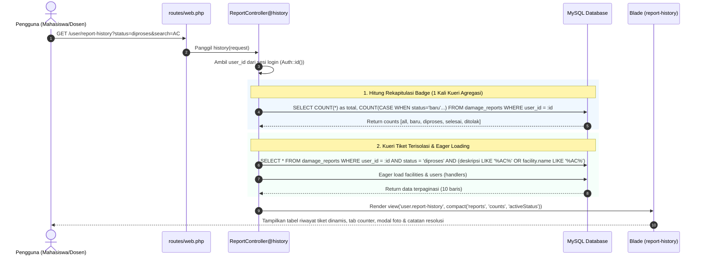

# Panduan Pembelajaran Kode: Fitur USR-04
*(Form Pelaporan Kerusakan & Malfungsi Fasilitas - CAVA)*

Dokumen ini disusun khusus sebagai **buku saku dan panduan belajar mendalam** untuk memahami 100% alur kerja, logika bisnis, keamanan unggah berkas, dan keputusan arsitektur di balik kode program fitur:
**USR-04: Form Pelaporan Kerusakan Fasilitas (Ticketing)**.

---

## 🗺️ Peta Konsep: Alur Pengaduan Tiket Kerusakan (*Request Lifecycle*)

Ketika seorang mahasiswa/dosen/staf mengisi formulir keluhan dan mengunggah foto bukti kerusakan, berikut adalah perjalanan data di balik layar:
# Panduan Pembelajaran Kode: Fitur USR-01 & USR-02
*(Sistem Reservasi & Pelaporan Fasilitas Kampus - CAVA)*

Dokumen ini disusun khusus sebagai **buku saku dan panduan belajar mendalam** bagi Anda untuk memahami 100% alur kerja, logika bisnis, dan keputusan teknis di balik kode program yang telah dibangun pada modul:
1. **USR-01:** Form Pengajuan Reservasi Ruangan
2. **USR-02:** Dasbor Riwayat & Status Reservasi Pengguna

---

## 🗺️ Peta Konsep: Bagaimana Laravel Bekerja (Request Lifecycle)

Ketika seorang pengguna membuka formulir dan menekan tombol **"Kirim Permohonan Reservasi"**, berikut adalah perjalanan data di balik layar:

```mermaid
sequenceDiagram
    autonumber
    actor User as Pengguna (Browser)
    participant Client as Alpine.js (Client Check)
    participant Route as routes/web.php
    participant Request as StoreDamageReportRequest
    participant Controller as ReportController
    participant Storage as File Storage (public/reports)
    participant DB as MySQL (damage_reports)
    participant View as Blade (report-history)

    User->>Client: Pilih berkas foto (JPG/PNG)
    alt Ukuran Berkas > 2 MB di Browser
        Client-->>User: Peringatan seketika "Ukuran melebihi 2 MB" (Batal Upload)
    else Ukuran Berkas Valid (<= 2 MB)
        Client->>User: Render pratinjau thumbnail (FileReader API)
        User->>Route: POST /user/reports (multipart/form-data)
        Route->>Request: Validasi MIME gambar, max:2048 KB, exists:facilities
        alt Validasi Gagal (Bukan gambar / file korup / deskripsi pendek)
            Request-->>User: Redirect Back + Error Messages + Old Input
        else Validasi Lolos
            Request->>Controller: Panggil method store(request)
            Controller->>Controller: Buat kode tiket unik (RPT-YYYYMMDD-XXXX)
            Controller->>Storage: Simpan berkas foto ke disk publik (reports/)
            Storage-->>Controller: Dapatkan path penyimpanan (reports/hash.jpg)
            Controller->>DB: INSERT into damage_reports (Status = 'baru')
            DB-->>Controller: Record tersimpan sukses
            Controller-->>View: Redirect ke /user/report-history + Flash Sukses
            View-->>User: Tampilkan Riwayat Tiket + Notifikasi Hijau
    participant Route as routes/web.php
    participant Request as StoreReservationRequest
    participant Controller as ReservationController
    participant Model as Eloquent (Reservation & Facility)
    participant DB as MySQL Database
    participant View as Blade (reservation-history)

    User->>Route: POST /user/reservations
    Route->>Request: Validasi input data (Jam, Slot 30m, Tanggal)
    alt Validasi Gagal (Jam salah / Menit bukan 00:30)
        Request-->>User: Redirect Back + Error Messages + Old Input
    else Validasi Lolos
        Request->>Controller: Panggil method store(request)
        Controller->>Model: Cek status fasilitas (bukan maintenance)
        Controller->>DB: DB::transaction() + Kueri Overlap (Anti-Bentrok)
        alt Jadwal Bentrok dengan Status Approved
            DB-->>Controller: Ditemukan jadwal bertabrakan
            Controller-->>User: Redirect Back + Pesan Error Bentrok
        else Bebas Bentrok
            Controller->>DB: INSERT into reservations (Status = pending)
            DB-->>Controller: Sukses simpan (Record ID & Ticket Code)
            Controller-->>View: Redirect ke /user/reservation-history + Flash Message
            View-->>User: Tampilkan Riwayat Reservasi + Notifikasi Sukses
        end
    end
```

---

## 📂 Bagian 1: Bedah Validasi Input & Keamanan Unggah Berkas

### 1.1. FormRequest: `app/Http/Requests/StoreDamageReportRequest.php`

## 📂 Bagian 1: Bedah Fitur USR-01 (Form Pengajuan Reservasi)

### 1.1. Validasi Input: `app/Http/Requests/StoreReservationRequest.php`

#### Mengapa Menggunakan `FormRequest` Terpisah?
Di Laravel pemula, validasi biasanya ditulis langsung di dalam *Controller* menggunakan `$request->validate([...])`. Namun, sesuai standar arsitektur profesional (*Clean Architecture*), kita memisahkannya ke dalam kelas `StoreReservationRequest` dengan tujuan:
- **Separation of Concerns (SoC):** Kontroler hanya mengurus alur logika bisnis, bukan memeriksa apakah email bertanda `@` atau jam berformat valid.
- **Dapat Digunakan Ulang (Reusable):** Aturan validasi yang sama dapat dipanggil di tempat lain tanpa menulis ulang.

#### Bedah Baris Kode Validasi:
```php
public function rules(): array
{
    return [
        'facility_id'      => ['required', 'integer', 'exists:facilities,id'],
        'category'         => ['required', 'string', 'max:100'],
        'description'      => ['required', 'string', 'min:10', 'max:1000'],
        'attachment_photo' => ['required', 'image', 'mimes:jpeg,png,jpg', 'max:2048'],
    ];
}
```

#### Mengapa Validasi Berkas Sangat Kritis?
Celah keamanan pada fitur unggah berkas (*File Upload Vulnerability*) adalah salah satu dari celah paling berbahaya (OWASP Top 10):
1. **`image`**:
   - Laravel membaca *magic bytes* (header biner) berkas untuk membuktikan berkas tersebut benar-benar sebuah gambar, bukan skrip PHP jahat yang sengaja diganti namanya menjadi `virus.php.jpg`.
2. **`mimes:jpeg,png,jpg`**:
   - Membatasi tipe MIME hanya pada format foto standar web.
3. **`max:2048`**:
   - Satuan aturan `max` untuk berkas pada Laravel adalah **Kilobyte (KB)**.
   - $2.048\text{ KB} = 2\text{ MB}$.
   - Mencegah serangan *Denial of Service* (DoS) di mana peretas mencoba menghabiskan ruang penyimpanan server lokal (*Disk Exhaustion*).
4. **`exists:facilities,id`**:
   - Memastikan bahwa ruangan yang dilaporkan benar-benar ada di tabel `facilities` kampus.
5. **`min:10`**:
   - Mencegah laporan asal-asalan seperti hanya mengetik kata *"rusak"* atau *"jelek"*. Pelapor diwajibkan menuliskan detail yang bermakna.

---

## 📂 Bagian 2: Bedah Antarmuka Dinamis (`report-form.blade.php`)

### 2.1. Atribut Wajib Formulir Unggah Berkas:
```blade
<form action="{{ route('user.reports.store') }}" method="POST" enctype="multipart/form-data">
    @csrf
```
- **`enctype="multipart/form-data"`**:
  - Secara default, form HTML mengirim data dalam format `application/x-www-form-urlencoded` yang hanya bisa membawa teks string.
  - Untuk mengirimkan aliran biner berkas foto (*binary stream*), atribut `enctype="multipart/form-data"` **mutlak wajib disertakan**. Jika lupa, `$request->file('attachment_photo')` di backend akan bernilai `null`!

### 2.2. Validasi Klien Cepat via Alpine.js (*Client-side Defense*):
```javascript
handleFile(e) {
    const file = e.target.files[0];
    if (file) {
        if (file.size > 2 * 1024 * 1024) {
            this.fileError = 'Ukuran berkas melebihi batas maksimal 2 MB...';
            e.target.value = '';
            this.imagePreview = null;
            return;
        }
        const reader = new FileReader();
        reader.onload = (event) => {
            this.imagePreview = event.target.result;
        };
        reader.readAsDataURL(file);
    }
}
```
- Menggunakan `FileReader` API peramban untuk membaca berkas lokal dan menampilkannya sebagai *data URL* (*Base64*) pada elemen `` tanpa harus mengunggahnya terlebih dahulu ke server (*Zero Network Cost*).
- Pengecekan `file.size > 2 * 1024 * 1024` langsung di peramban menghemat kuota internet pengguna dan mengurangi beban lalu lintas jaringan (*bandwidth efficiency*).

### 2.3. Retensi Data Masukan Pasca-Error:
- Kolom deskripsi menggunakan `{{ old('description') }}` agar ketikan panjang pelapor tidak hilang jika validasi server menolak foto.
- Dropdown fasilitas mengingat pilihan pengguna dengan: `{{ old('facility_id', $selectedFacilityId) == $facility->id ? 'selected' : '' }}`.

---

## 📂 Bagian 3: Bedah Logika Kontroler (`ReportController.php`)

```php
public function store(StoreDamageReportRequest $request): RedirectResponse
{
    $validated = $request->validated();
    $userId = Auth::id() ?? 1;

    // 1. Generate Kode Tiket Laporan Unik (RPT-YYYYMMDD-XXXX)
    $datePrefix = Carbon::now()->format('Ymd');
    do {
        $randomSeq  = strtoupper(substr(bin2hex(random_bytes(2)), 0, 4));
        $reportCode = sprintf('RPT-%s-%s', $datePrefix, $randomSeq);
    } while (DamageReport::where('report_code', $reportCode)->exists());

    // 2. Unggah Foto Bukti ke Storage Public Disk
    $photoPath = null;
    if ($request->hasFile('attachment_photo')) {
        $photoPath = $request->file('attachment_photo')->store('reports', 'public');
    }

    // 3. Simpan Data Tiket Pengaduan ke Database
    $report = DamageReport::create([
        'report_code'        => $reportCode,
        'user_id'            => $userId,
        'facility_id'        => $validated['facility_id'],
        'category'           => $validated['category'],
        'description'        => $validated['description'],
        'attachment_photo'   => $photoPath,
        'status'             => 'baru',
        'is_facility_locked' => false,
    ]);

    return redirect()->route('user.report-history')
        ->with('success', "Laporan kerusakan berhasil dikirim dengan kode tiket {$reportCode}...");
}
```

### Mengapa Menggunakan `$request->file(...)->store('reports', 'public')`?
1. **Penamaan Berkas Acak yang Aman (*Hashed Filename*):**
   - Laravel secara otomatis membuat nama acak unik (seperti `a8f9c2d1b5...jpg`).
   - Mencegah penimpaan file jika dua mahasiswa mengunggah foto dengan nama yang sama persis (misal: `foto.jpg`).
2. **Penyimpanan di Disk Publik:**
   - Disimpan di `storage/app/public/reports`, yang ditautkan ke `public/storage/reports` via `php artisan storage:link`.
   - Foto dapat ditampilkan secara publik kepada teknisi dan admin di dasbor mereka melalui `asset('storage/' . $report->attachment_photo)`.

---

## 🧪 Bagian 4: Bedah Pengujian Otomatis (`ReportFeatureTest.php`)

```php
test('USR-04: Pengguna berhasil mengirim laporan kerusakan dengan foto bukti valid (TC-USR04-02)', function () {
    $fakeImage = UploadedFile::fake()->create('bukti_kerusakan.jpg', 500, 'image/jpeg');

    $payload = [
        'facility_id'      => $this->facility->id,
        'category'         => 'AC & Pendingin',
        'description'      => 'Unit AC di baris depan mati total dan mengeluarkan bau hangus.',
        'attachment_photo' => $fakeImage,
    ];

    $response = $this->actingAs($this->user)->post(route('user.reports.store'), $payload);

    $response->assertRedirect(route('user.report-history'));
    $response->assertSessionHas('success');

    $this->assertDatabaseHas('damage_reports', [
        'user_id'     => $this->user->id,
        'facility_id' => $this->facility->id,
        'status'      => 'baru',
    ]);
});
```

### Catatan Teknis Pengujian Pest:
- **`UploadedFile::fake()->create('bukti.jpg', 500, 'image/jpeg')`**:
  - Digunakan untuk mensimulasikan file unggahan berukuran 500 KB tanpa bergantung pada ekstensi PHP `gd` di mesin pengembang.
- **`Storage::fake('public')`**:
  - Menyediakan direktori virtual di memori saat pengujian berlangsung, sehingga folder `storage` lokal asli tidak akan tercemar oleh foto-foto sampah uji coba.

        'reservation_date' => ['required', 'date', 'after_or_equal:today'],
        'start_time'       => ['required', 'date_format:H:i', 'regex:/^(0[7-9]|1[0-9]|20):(00|30)$/'],
        'end_time'         => ['required', 'date_format:H:i', 'after:start_time', 'regex:/^(0[7-9]|1[0-9]|20):(00|30)$/'],
        'purpose'          => ['required', 'string', 'min:10', 'max:500'],
    ];
}
```

1. **`exists:facilities,id`**:
   - Memastikan ID fasilitas yang dikirim pengguna **benar-benar ada** di kolom `id` tabel `facilities`. Jika ada orang jahil mengubah nilai `<option value="9999">` melalui *Inspect Element*, Laravel akan otomatis menggagalkannya!
2. **`after_or_equal:today`**:
   - Memastikan tanggal kegiatan tidak boleh di masa lampau. Jika hari ini tanggal 23, pengguna tidak bisa memesan untuk tanggal 22 kemarin.
3. **`after:start_time`**:
   - Memastikan urutan kronologis waktu: jam selesai wajib lebih akhir daripada jam mulai.
4. **Bedah Regex Sakti Jam Operasional & Slot 30 Menit:**
   ```regex
   /^(0[7-9]|1[0-9]|20):(00|30)$/
   ```
   Mari kita pecah logika ekspresi reguler (*Regex*) ini:
   - `^` : Mulai pencocokan dari awal string.
   - `(0[7-9]|1[0-9]|20)` : Mengunci jam operasional **07:00 s/d 20:00 WIB**:
     - `0[7-9]` $\rightarrow$ mencocokkan jam `07`, `08`, `09`.
     - `1[0-9]` $\rightarrow$ mencocokkan jam `10`, `11`, `12`, `13`, `14`, `15`, `16`, `17`, `18`, `19`.
     - `20` $\rightarrow$ mencocokkan jam `20`.
     - *(Artinya: Jam `06` pagi atau `21` malam otomatis DITOLAK).*
   - `:` : Tanda pemisah jam dan menit.
   - `(00|30)` : Mengunci aturan kelipatan 30 menit! **Hanya menerima angka `00` atau `30`**. *(Menit `15`, `45`, atau `59` otomatis DITOLAK).*
   - `$` : Akhir pencocokan string.

---

### 1.2. Logika Kontroler: `app/Http/Controllers/ReservationController.php`

#### A. Method `create()` (Menampilkan Form)
```php
public function create(Request $request): View
{
    $facilities = Facility::where('status', 'aktif')
        ->orderBy('name')
        ->get();

    $selectedFacilityId = $request->query('facility_id');

    return view('user.reservation-form', compact('facilities', 'selectedFacilityId'));
}
```
- **`where('status', 'aktif')`**: Hanya ruangan yang sehat dan aktif yang disuplai ke form. Ruangan yang sedang rusak/pemeliharaan tidak akan muncul di opsi.
- **`$request->query('facility_id')`**: Menangkap parameter jika pengguna datang dari tombol *"Reservasi Ruang Ini"* di katalog publik (`?facility_id=2`), sehingga ruangan tersebut langsung terpilih otomatis.

#### B. Method `store()` (Penyimpanan & Anti-Bentrok)

##### 1. Pembuatan Kode Tiket Unik Otomatis
```php
$datePrefix = Carbon::parse($validated['reservation_date'])->format('Ymd');
$randomSeq  = strtoupper(substr(bin2hex(random_bytes(2)), 0, 4));
$ticketCode = sprintf('TKT-%s-%s', $datePrefix, $randomSeq);

while (Reservation::where('ticket_code', $ticketCode)->exists()) {
    $randomSeq  = strtoupper(substr(bin2hex(random_bytes(2)), 0, 4));
    $ticketCode = sprintf('TKT-%s-%s', $datePrefix, $randomSeq);
}
```
- **Konsep:** Tiket memiliki format `TKT-YYYYMMDD-XXXX` (contoh: `TKT-20260924-A1B2`).
- **Loop `while`:** Menjamin 100% keunikan kode. Jika string acak kebetulan sudah pernah ada di database, sistem akan mengulang pengacakan hingga menemukan kode yang benar-benar baru.

##### 2. Transaksi Basis Data (`DB::transaction()`)
```php
return DB::transaction(function () use (...) {
    // kueri overlap & simpan
});
```
- **Mengapa Wajib?** Bayangkan 2 mahasiswa menekan tombol submit di detik yang sama. Dengan `DB::transaction()`, MySQL menjamin bahwa operasi pemeriksaan dan penyimpanan berjalan sebagai satu kesatuan utuh (*Atomic*). Jika ada kegagalan di tengah jalan, seluruh perubahan akan di-*rollback* (dibatalkan) sehingga tidak ada data sampah/korup.

##### 3. Rumus Matematika Anti-Bentrok (*Schedule Overlap Logic*)
Ini adalah bagian **paling krusial** yang sering ditanyakan dosen penguji:
```php
$overlapExists = Reservation::where('facility_id', $validated['facility_id'])
    ->where('reservation_date', $validated['reservation_date'])
    ->where('status', 'approved')
    ->where(function ($query) use ($validated) {
        $query->where('start_time', '<', $validated['end_time'])
              ->where('end_time', '>', $validated['start_time']);
    })
    ->exists();
```

**Bagaimana Rumus `(start < req_end AND end > req_start)` Bekerja?**
Dua rentang waktu $[A_{mulai}, A_{selesai}]$ dan $[B_{mulai}, B_{selesai}]$ dikatakan bertabrakan (*overlap*) jika dan hanya jika:
$$A_{mulai} < B_{selesai} \quad \text{DAN} \quad A_{selesai} > B_{mulai}$$

Mari kita uji dengan contoh nyata:
> *Jadwal di Database (Approved):* **10:00 - 12:00** ($A_{mulai} = 10, A_{selesai} = 12$)

| Skenario Pengajuan Baru | $B_{mulai}$ | $B_{selesai}$ | $A_{mulai} < B_{selesai}$? | $A_{selesai} > B_{mulai}$? | Hasil Evaluasi | Status |
|---|---|---|---|---|---|---|
| **Kasus 1: Menabrak di depan** (09:00 - 11:00) | 09:00 | 11:00 | $10 < 11$ (YA) | $12 > 09$ (YA) | **BENTROK!** | DITOLAK ❌ |
| **Kasus 2: Menabrak di dalam** (10:30 - 11:30) | 10:30 | 11:30 | $10 < 11:30$ (YA) | $12 > 10:30$ (YA) | **BENTROK!** | DITOLAK ❌ |
| **Kasus 3: Menabrak di belakang** (11:00 - 13:00) | 11:00 | 13:00 | $10 < 13$ (YA) | $12 > 11$ (YA) | **BENTROK!** | DITOLAK ❌ |
| **Kasus 4: Melingkupi semua** (08:00 - 14:00) | 08:00 | 14:00 | $10 < 14$ (YA) | $12 > 08$ (YA) | **BENTROK!** | DITOLAK ❌ |
| **Kasus 5: Selesai sebelum jadwal** (08:00 - 10:00) | 08:00 | 10:00 | $10 < 10$ (TIDAK) | $12 > 08$ (YA) | **AMAN!** | DIIZINKAN ✅ |
| **Kasus 6: Mulai setelah jadwal** (12:00 - 14:00) | 12:00 | 14:00 | $10 < 14$ (YA) | $12 > 12$ (TIDAK) | **AMAN!** | DIIZINKAN ✅ |

*Hanya dengan dua baris kueri sederhana ini, seluruh skenario bentrok waktu tertangani secara matematis!*

---

### 1.3. Antarmuka Formulir: `resources/views/user/reservation-form.blade.php`

1. **Token `@csrf`**:
   - Menghasilkan elemen `<input type="hidden" name="_token" value="...">`.
   - Mencegah serangan *Cross-Site Request Forgery*, di mana situs web jahat mencoba mengirim form atas nama pengguna yang sedang login tanpa sepengetahuannya.
2. **Fungsi `old('field_name', default)`**:
   - Jika pengguna salah mengisi form dan server menolaknya, nilai input yang sudah diketik sebelumnya **tidak hilang terhapus**. Pengguna tidak perlu mengetik ulang tujuan kegiatan dari nol!
3. **Direktif `@error('field_name') ... @enderror`**:
   - Mengecek apakah ada pesan kesalahan untuk kolom tersebut dari `$errors`. Jika ada, Blade akan menampilkan pesan teks merah tepat di bawah kotak input terkait.
4. **Jembatan PHP ke Alpine.js (`facilitiesData`)**:
   ```blade
   facilitiesData: {{ json_encode($facilitiesMap) }}
   ```
   Data fasilitas dari database PHP diubah menjadi format objek JavaScript JSON. Dengan begitu, Alpine.js di peramban dapat membaca nama gedung dan kapasitas ruangan secara instan saat dropdown dipilih tanpa perlu memanggil server (*Zero Latency*).

---

## 📂 Bagian 2: Bedah Fitur USR-02 (Dasbor Riwayat & Detail Reservasi)

### 2.1. Logika Kontroler: `ReservationController@history`

```php
public function history(Request $request): View
{
    $userId = Auth::id() ?? 1;

    // 1. Hitung Badge Count per Status
    $counts = [
        'all'       => Reservation::where('user_id', $userId)->count(),
        'pending'   => Reservation::where('user_id', $userId)->where('status', 'pending')->count(),
        'approved'  => Reservation::where('user_id', $userId)->where('status', 'approved')->count(),
        'rejected'  => Reservation::where('user_id', $userId)->where('status', 'rejected')->count(),
        'cancelled' => Reservation::where('user_id', $userId)->where('status', 'cancelled')->count(),
    ];

    // 2. Kueri Eager Loading Bebas N+1
    $query = Reservation::with(['facility', 'reviewer'])
        ->where('user_id', $userId)
        ->orderBy('created_at', 'desc');

    // 3. Filter Status Tab
    $activeStatus = $request->query('status', 'all');
    if ($activeStatus !== 'all' && in_array($activeStatus, ['pending', 'approved', 'rejected', 'cancelled', 'completed'])) {
        $query->where('status', $activeStatus);
    }

    // 4. Filter Pencarian Kata Kunci
    $keyword = trim($request->query('search', ''));
    if (!empty($keyword)) {
        $query->where(function ($q) use ($keyword) {
            $q->where('ticket_code', 'LIKE', '%' . $keyword . '%')
              ->orWhere('purpose', 'LIKE', '%' . $keyword . '%')
              ->orWhereHas('facility', function ($fQuery) use ($keyword) {
                  $fQuery->where('name', 'LIKE', '%' . $keyword . '%')
                         ->orWhere('building', 'LIKE', '%' . $keyword . '%');
              });
        });
    }

    // 5. Paginasi Mempertahankan URL Query
    $reservations = $query->paginate(10)->withQueryString();

    return view('user.reservation-history', compact('reservations', 'counts', 'activeStatus', 'keyword'));
}
```

#### Apa itu Masalah *N+1 Query Problem* dan Cara Menyelesaikannya?
- **Masalah (Tanpa Eager Loading):**
  Jika Anda memanggil `Reservation::all()`, lalu di tampilan Blade Anda menulis `$res->facility->name`, Laravel akan mengeksekusi 1 kueri untuk mengambil 10 reservasi, ditambah 10 kueri SQL terpisah untuk masing-masing fasilitas. Total: **11 kali kueri ke database!** Jika ada 100 reservasi, database akan dihujani 101 kueri yang membuat server lemot.
- **Solusi (`with(['facility', 'reviewer'])`):**
  Laravel mengeksekusi kueri reservasi, lalu hanya mengeksekusi **1 kueri tambahan** menggunakan klausa `WHERE id IN (1, 2, 3...)` untuk mengambil seluruh fasilitas sekaligus. Total kueri hanya **2 kali**, berapa pun jumlah datanya!

#### Apa itu `whereHas('facility', ...)`?
Klausa ini memungkinkan pencarian berdasarkan data pada tabel relasi (*Foreign Table*). Jika pengguna mencari kata `"Auditorium"`, Laravel mencari baris di tabel `reservations` yang tabel `facilities`-nya memiliki nama mengandung kata `"Auditorium"`.

#### Mengapa Menggunakan `withQueryString()`?
Saat pengguna sedang menyaring tab *Pending* di halaman 2 (`?status=pending&page=2`), jika kita tidak menambahkan `withQueryString()`, tautan paginasi tombol halaman berikutnya akan menghapus parameter `status` dan kembali ke halaman semua. `withQueryString()` memastikan parameter pencarian dan status tetap menempel pada tautan nomor halaman.

---

### 2.2. Antarmuka Riwayat: `resources/views/user/reservation-history.blade.php`

1. **Struktur `@forelse` dan `@empty`**:
   ```blade
   @forelse ($reservations as $res)
       {{-- Render baris tabel --}}
   @empty
       {{-- Tampilan saat data kosong (Empty State) --}}
   @endforelse
   ```
   Menggantikan pola usang `if (count > 0) foreach ... else ...`. Lebih bersih, ringkas, dan modern.
2. **Logika Tombol Batal Mandiri (Batas H-1)**:
   ```blade
   $isHMinus1 = $resDate->isFuture() && now()->diffInDays($resDate, false) >= 1 && in_array($res->status, ['pending', 'approved']);
   ```
   Tombol "Batal" hanya akan muncul di layar jika:
   - Tanggal kegiatan berada di masa depan (`isFuture()`).
   - Selisih waktu dari hari ini minimal 1 hari (`diffInDays >= 1`).
   - Statusnya masih `pending` atau `approved`. Jika sudah `rejected` atau `cancelled`, tombol batal tidak akan ditampilkan.
3. **Modal Dialog Detail Berbasis Alpine.js**:
   - Seluruh data baris tiket dikemas ke dalam objek JSON kecil: `@click="openDetail({{ json_encode($ticketData) }})"`.
   - Saat tombol diklik, Alpine.js langsung mengisi variabel `selectedTicket` dan memunculkan pop-up modal secara instan di peramban tanpa perlu membebani server dengan request AJAX baru.

---

## 📂 Bagian 3: Bedah Fitur USR-03 (Pembatalan Reservasi Mandiri Batas H-1)

### 3.1. Logika Bisnis: `ReservationController@cancel`

```php
public function cancel(Request $request, int|string $id): RedirectResponse
{
    $userId = Auth::id() ?? 1;
    $reservation = Reservation::findOrFail($id);

    // 1. Otorisasi Kepemilikan (Strict Ownership - BR-USR03-01)
    if ((int) $reservation->user_id !== (int) $userId) {
        abort(403, 'Akses ditolak. Anda tidak memiliki izin untuk membatalkan tiket reservasi ini.');
    }

    // 2. Validasi Kelayakan Status (BR-USR03-03)
    if (!in_array($reservation->status, ['pending', 'approved'])) {
        return back()->withErrors([
            'error' => 'Reservasi ini tidak dapat dibatalkan karena sudah dalam status ' . $reservation->status . '.',
        ]);
    }

    // 3. Validasi Batas Waktu H-1 / 24 Jam (BR-USR03-02)
    $resDateTime = Carbon::parse($reservation->reservation_date)->setTimeFromTimeString($reservation->start_time);
    if (now()->diffInSeconds($resDateTime, false) < 86400) {
        return back()->withErrors([
            'error' => 'Pembatalan mandiri ditolak. Batas waktu pembatalan maksimal adalah H-1 (minimal 24 jam) sebelum acara dimulai.',
        ]);
    }

    // 4. Update Status dan Alasan Pembatalan (BR-USR03-04 & BR-USR03-05)
    $inputReason = trim($request->input('cancellation_reason', ''));
    $reservation->status = 'cancelled';
    $reservation->cancellation_reason = !empty($inputReason) ? $inputReason : 'Dibatalkan mandiri oleh pemohon.';
    $reservation->save();

    return redirect()->route('user.reservation-history')
        ->with('success', "Tiket reservasi {$reservation->ticket_code} berhasil dibatalkan. Fasilitas telah dilepas kembali ke kalender ketersediaan.");
}
```

#### Bedah Logika Kritis:
1. **Otorisasi Ketat (`abort(403)`):**
   - Mencegah serangan *Insecure Direct Object Reference* (IDOR). Jika Mahasiswa A sengaja mengubah form action ke ID tiket milik Mahasiswa B (`/user/reservations/99/cancel`), server akan menolak akses dengan kode HTTP 403 Forbidden.
2. **Perhitungan Presisi H-1 via Carbon:**
   - `$resDateTime = Carbon::parse($res->reservation_date)->setTimeFromTimeString($res->start_time);`
   - `now()->diffInSeconds($resDateTime, false) < 86400`:
     - 86.400 detik = 24 jam. Parameter `false` memastikan selisih bertanda positif/negatif (jika waktu acara sudah lewat, hasilnya negatif sehingga otomatis $< 86400$ dan ditolak).
3. **Pelepasan Slot Otomatis (*Auto Release*):**
   - Karena kueri anti-bentrok pada USR-01 hanya mengunci status `approved`, ketika status berubah menjadi `cancelled`, secara otomatis slot ruangan tersebut langsung bebas dan dapat dipesan oleh sivitas lain tanpa perlu intervensi admin.

---

## 🧪 Bagian 4: Bedah Pengujian Otomatis (`tests/Feature/ReservationFeatureTest.php`)

Pengujian otomatis (*Automated Testing*) menjamin bahwa fitur yang kita buat tidak akan rusak di kemudian hari saat anggota tim lain mengedit kode.

```php
test('USR-03: Pengguna berhasil membatalkan reservasi status pending lebih dari 24 jam (TC-USR03-01)', function () {
    $futureDate = Carbon::now()->addDays(3)->format('Y-m-d');
    $reservation = Reservation::create([...]);

    $response = $this->actingAs($this->user)->delete(route('user.reservations.cancel', $reservation->id));

    $response->assertRedirect(route('user.reservation-history'));
    $response->assertSessionHas('success');
    $this->assertDatabaseHas('reservations', [
        'id'     => $reservation->id,
        'status' => 'cancelled',
    ]);
});
```

---

## 🎓 Tanya Jawab Kunci (Persiapan Sidang / Review Dosen)

| Pertanyaan Penguji | Jawaban Teknis Terbaik Anda |
|---|---|
| *"Mengapa foto bukti tidak disimpan langsung sebagai biner (BLOB) di tabel MySQL?"* | "Menyimpan gambar langsung di database MySQL (tipe BLOB) akan menyebabkan ukuran basis data membengkak drastis (*Database Bloat*), memperlambat proses *backup/restore*, serta menghabiskan memori RAM server database. Praktik standar industri terbaik adalah menyimpan file fisik di sistem penyimpanan berkas (*File Storage Disk*) dan hanya menyimpan alamat jalurnya (*file path*) pada kolom basis data." |
| *"Bagaimana Anda mencegah celah keamanan unggah berkas (misal ada yang mencoba mengunggah shell PHP)?"* | "Pertama, kami menerapkan validasi aturan `image` dan `mimes:jpeg,png,jpg` pada `StoreDamageReportRequest` yang memeriksa header biner (*Magic Bytes*) berkas, bukan sekadar melihat ekstensi nama file. Kedua, method `store()` Laravel mengacak nama file menjadi string *hash* unik di direktori terisolasi, sehingga file tidak dapat dieksekusi langsung oleh penyerang." |
| *"Mengapa validasi ukuran maksimal 2 MB dilakukan di dua tempat (JavaScript dan PHP Laravel)?"* | "Ini adalah penerapan prinsip *Defense in Depth*. Validasi di sisi peramban (JavaScript) ditujukan untuk *User Experience* agar pengguna langsung tahu bahwa file-nya kebesaran tanpa harus menunggu proses upload yang lama. Sedangkan validasi di sisi server (Laravel) adalah benteng pertahanan mutlak (*Zero Trust*) yang tidak bisa di-bypass meskipun pengguna mematikan JavaScript atau mengirim request via cURL/Postman." |
| *"Apa arti status awal 'baru' pada tiket laporan kerusakan?"* | "Status `'baru'` adalah status awal (*Initial State*) pada alur kerja *ticketing*. Status ini menandakan bahwa laporan telah berhasil dicatat oleh sistem namun belum diinspeksi atau dialokasikan oleh Petugas Sarpras ke teknisi lapangan." |

---

# Panduan Pembelajaran Kode: Fitur USR-05
*(Pelacakan Status & Riwayat Laporan Kerusakan - CAVA)*

Dokumen ini melengkapi bab sebelumnya untuk memahami secara tuntas alur kerja, logika kueri efisien, dan rendering dinamis dari fitur:
**USR-05: Pelacakan Status Laporan (Tiket) Pengguna**.

---

## 🗺️ Peta Konsep: Alur Pelacakan Tiket Kerusakan (*Query Lifecycle*)



---

## 📂 Bagian 1: Bedah Logika Backend & Optimalisasi Kueri (`ReportController.php`)

### 1.1. Agregasi Tunggal (*Single-Query Conditional Aggregation*)
Menghitung jumlah tiket pada masing-masing tab status (`Semua`, `Baru`, `Diproses`, `Selesai`, `Ditolak`) sering kali dilakukan dengan 5 kali pemanggilan `count()`. Hal ini memicu 5 kali round-trip ke database:

```php
// ❌ KURANG OPTIMAL: Memicu 5 kali kueri kueri ke MySQL
$all      = DamageReport::where('user_id', $userId)->count();
$baru     = DamageReport::where('user_id', $userId)->where('status', 'baru')->count();
$diproses = DamageReport::where('user_id', $userId)->where('status', 'diproses')->count();
$selesai  = DamageReport::where('user_id', $userId)->where('status', 'selesai')->count();
$ditolak  = DamageReport::where('user_id', $userId)->where('status', 'ditolak')->count();
```

Di CAVA, kita mengoptimalkannya menjadi **1 kueri tunggal yang sangat cepat**:
```php
// ✅ SANGAT OPTIMAL: Hanya 1 kali kueri dengan CASE WHEN
$rawCounts = DamageReport::where('user_id', $userId)
    ->selectRaw("
        COUNT(*) as total,
        COUNT(CASE WHEN status = 'baru' THEN 1 END) as baru,
        COUNT(CASE WHEN status = 'diproses' THEN 1 END) as diproses,
        COUNT(CASE WHEN status = 'selesai' THEN 1 END) as selesai,
        COUNT(CASE WHEN status = 'ditolak' THEN 1 END) as ditolak
    ")->first();
```

### 1.2. Pencegahan Kebocoran Data (*Security: IDOR Prevention*)
Klausul `where('user_id', $userId)` dipasang secara mutlak pada kueri utama. Pengguna hanya dapat memantau tiket yang diajukan oleh akunnya sendiri. Hal ini mencegah kerentanan **IDOR (*Insecure Direct Object Reference*)**.

### 1.3. Eliminasi *N+1 Query Problem* via Eager Loading
Setiap baris laporan memerlukan nama fasilitas (`$report->facility->name`) dan nama petugas penangan (`$report->handler->name`).
- Jika tanpa Eager Loading (Lazy Loading), menampilkan 10 baris laporan akan menghasilkan **1 + 10 + 10 = 21 kueri database**!
- Dengan Eager Loading:
  ```php
  $query = DamageReport::with(['facility', 'handler'])->where('user_id', $userId);
  ```
  MySQL hanya mengeksekusi **3 kueri**: 1 kueri utama laporan, 1 kueri untuk mengambil fasilitas terkait (`WHERE id IN (...)`), dan 1 kueri untuk mengambil data teknisi.

### 1.4. Pencarian Lintas Tabel Menggunakan `whereHas`
Ketika pengguna mencari fasilitas (misal: "Lab Jaringan"), kata kunci tidak berada di tabel `damage_reports`, melainkan di tabel `facilities`. Eloquent `whereHas` menyatukan kueri secara elegan:
```php
$query->where(function ($q) use ($keyword) {
    $q->where('report_code', 'like', "%{$keyword}%")
      ->orWhere('description', 'like', "%{$keyword}%")
      ->orWhere('category', 'like', "%{$keyword}%")
      ->orWhereHas('facility', function ($fq) use ($keyword) {
          $fq->where('name', 'like', "%{$keyword}%");
      });
});
```

---

## 📂 Bagian 2: Bedah Antarmuka Dinamis (`report-history.blade.php`)

### 2.1. Mempertahankan Parameter URL Saat Pindah Tab atau Paging
Ketika pengguna memfilter status ke `"diproses"` lalu melakukan pencarian, URL yang terbentuk adalah:
`/user/report-history?status=diproses&search=proyektor`

Di Blade, link tab status dibuat menggunakan helper pintar:
```blade
$url = request()->fullUrlWithQuery(['status' => $key, 'page' => 1]);
```
Dan pada controller, paginasi dilengkapi dengan:
```php
$reports = $query->orderBy('created_at', 'desc')->paginate(10)->withQueryString();
```
`withQueryString()` memastikan bahwa saat pengguna mengklik tombol halaman 2 atau 3, parameter `status` dan `search` **tidak hilang**.

### 2.2. Modal Pratinjau Foto Riil (Alpine.js)
Foto yang tersimpan di disk publik dipanggil dengan helper `asset('storage/' . $report->attachment_photo)`. Objek data dikirimkan ke fungsi Alpine.js:
```blade
@php
    $photoData = [
        'id'       => $report->report_code,
        'venue'    => $report->facility->name ?? 'Fasilitas Kampus',
        'desc'     => $report->description,
        'photoUrl' => $report->attachment_photo ? asset('storage/' . $report->attachment_photo) : null,
    ];
@endphp
<button @click="openPhoto({{ json_encode($photoData) }})">Lihat</button>
```
Sehingga tidak ada lagi foto palsu dummy Unsplash di dalam kode!

---

## 🧪 Bagian 3: Bedah Pengujian Otomatis (`ReportFeatureTest.php`)

10 pengujian otomatis dijalankan secara terisolasi menggunakan transaksi basis data:
1. **TC-USR05-01:** Verifikasi bahwa tiket pelapor tampil lengkap dengan kode tiket, nama fasilitas, deskripsi, dan badge status.
2. **TC-USR05-02:** Verifikasi isolasi keamanan (`assertDontSee`), memastikan laporan mahasiswa lain tidak bocor.
3. **TC-USR05-03:** Verifikasi tab filter status (`?status=baru`, `?status=selesai`).
4. **TC-USR05-04:** Verifikasi pencarian kata kunci (`?search=...`).

---

## 🎓 Tanya Jawab Kunci USR-05 (Persiapan Sidang / Evaluasi)

| Pertanyaan Penguji | Jawaban Teknis Terbaik Anda |
|---|---|
| *"Bagaimana Anda menjamin mahasiswa tidak bisa mengintip laporan kerusakan yang diajukan oleh pengguna lain?"* | "Pada method `history()` di `ReportController`, kueri database secara absolut dibatasi dengan `where('user_id', Auth::id())`. Dengan begitu, meskipun pengguna mencoba memanipulasi parameter URL atau request query, kueri SQL di tingkat server hanya akan mengambil data milik pengguna yang sedang terautentikasi." |
| *"Apa itu problem N+1 kueri dan bagaimana Anda mengatasinya di halaman riwayat ini?"* | "Problem N+1 terjadi jika kita me-looping relasi (seperti `$report->facility->name`) di dalam Blade tanpa memuat relasi terlebih dahulu, sehingga database dipaksa melakukan 1 kueri tambahan untuk setiap baris data yang ditampilkan. Kami mengatasinya menggunakan fitur Eager Loading Eloquent: `DamageReport::with(['facility', 'handler'])`, sehingga puluhan baris data hanya membutuhkan 3 kueri SQL." |
| *"Mengapa Anda menggunakan conditional aggregation (CASE WHEN) untuk badge counter?"* | "Untuk menghindari *round-trip overhead* ke database server. Jika menggunakan 5 pemanggilan `count()` terpisah, aplikasi membuka dan menunggu 5 koneksi kueri ke MySQL. Dengan agregasi berkondisi tunggal `COUNT(CASE WHEN status = ... THEN 1 END)`, seluruh total rekapitulasi status selesai dihitung dalam satu kali eksekusi kueri berkecepatan tinggi." |
| *"Bagaimana cara mempertahankan kata kunci pencarian ketika pengguna mengklik pagination ke halaman berikutnya?"* | "Kami menambahkan method berantai `->withQueryString()` pada pemanggilan `paginate(10)` di Controller. Method ini secara otomatis menyalin seluruh *query string parameters* yang ada di URL saat ini ke dalam tautan link tombol pagination yang dihasilkan oleh Laravel." |

| *"Bagaimana sistem Anda mencegah dua orang meminjam ruangan yang sama di jam yang sama (double-booking)?"* | "Sistem menerapkan validasi ganda. Pada level basis data, kami menggunakan transaksi `DB::transaction()` dan mengeksekusi kueri overlap matematis: `start_time < req_end AND end_time > req_start` terhadap seluruh reservasi berstatus `approved`. Jika kueri menemukan singgungan jadwal, transaksi langsung digagalkan sebelum data tersimpan." |
| *"Mengapa validasi jam 07:00-20:00 dan kelipatan 30 menit tidak cukup divalidasi di form HTML saja?"* | "Validasi klien (HTML) hanya untuk kenyamanan pengguna (*User Experience*), tetapi sangat mudah dimanipulasi melalui inspect element browser atau tools seperti Postman. Oleh karena itu, sistem menerapkan kebijakan *Zero Trust* dengan memvalidasi ulang secara mutlak di sisi server menggunakan *Regular Expression* pada `StoreReservationRequest`." |
| *"Bagaimana Anda menjamin mahasiswa A tidak bisa membatalkan tiket reservasi milik mahasiswa B?"* | "Kami menerapkan validasi kepemilikan mutlak (*Strict Ownership*) pada `ReservationController@cancel`. Sistem memeriksa apakah `reservation->user_id === Auth::id()`. Jika terjadi ketidakcocokan, sistem langsung melempar exception `abort(403, 'Akses Ditolak')`." |
| *"Bagaimana cara kerja validasi batas H-1 pembatalan reservasi?"* | "Kami menggabungkan `reservation_date` dan `start_time` menjadi satu objek `Carbon`, kemudian menghitung selisih waktu detik dengan `now()`. Jika sisa waktu menuju jam mulai acara kurang dari 86.400 detik (24 jam), sistem menolak pembatalan dengan pesan validasi bahwa batas waktu pembatalan mandiri telah berakhir." |
| *"Apa strategi Anda untuk mencegah aplikasi lambat saat data reservasi mencapai ribuan?"* | "Pertama, kami menerapkan *Eager Loading* `with(['facility', 'reviewer'])` untuk mengeliminasi masalah *N+1 query*. Kedua, tabel `reservations` telah dipasangi indeks komposit `idx_res_facility_date_status` pada migrasi database. Ketiga, antarmuka riwayat dibatasi menggunakan paginasi 10 baris per halaman." |
