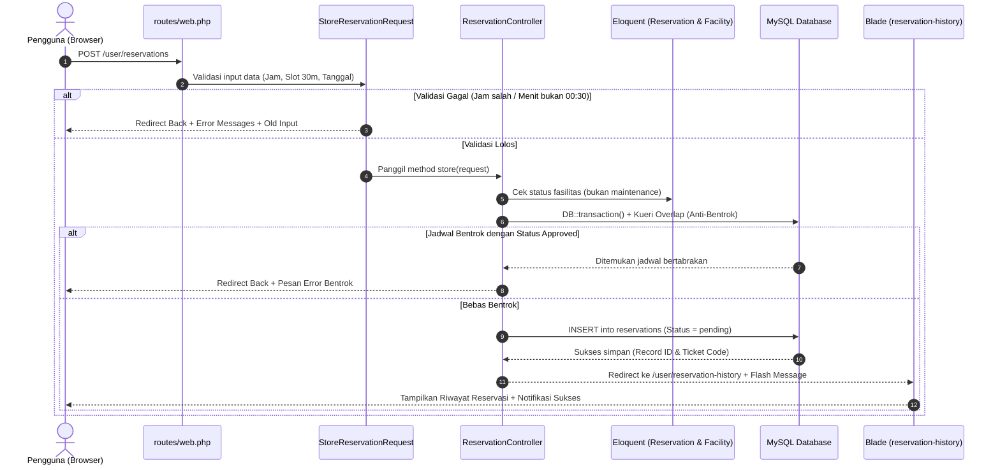

# Panduan Pembelajaran Kode: Fitur USR-01 & USR-02
*(Sistem Reservasi & Pelaporan Fasilitas Kampus - CAVA)*

Dokumen ini disusun khusus sebagai **buku saku dan panduan belajar mendalam** bagi Anda untuk memahami 100% alur kerja, logika bisnis, dan keputusan teknis di balik kode program yang telah dibangun pada modul:
1. **USR-01:** Form Pengajuan Reservasi Ruangan
2. **USR-02:** Dasbor Riwayat & Status Reservasi Pengguna

---

## 🗺️ Peta Konsep: Bagaimana Laravel Bekerja (Request Lifecycle)

Ketika seorang pengguna membuka formulir dan menekan tombol **"Kirim Permohonan Reservasi"**, berikut adalah perjalanan data di balik layar:



---

## 📂 Bagian 1: Bedah Fitur USR-01 (Form Pengajuan Reservasi)

### 1.1. Validasi Input: `app/Http/Requests/StoreReservationRequest.php`

#### Mengapa Menggunakan `FormRequest` Terpisah?
Di Laravel pemula, validasi biasanya ditulis langsung di dalam *Controller* menggunakan `$request->validate([...])`. Namun, sesuai standar arsitektur profesional (*Clean Architecture*), kita memisahkannya ke dalam kelas `StoreReservationRequest` dengan tujuan:
- **Separation of Concerns (SoC):** Kontroler hanya mengurus alur logika bisnis, bukan memeriksa apakah email bertanda `@` atau jam berformat valid.
- **Dapat Digunakan Ulang (Reusable):** Aturan validasi yang sama dapat dipanggil di tempat lain tanpa menulis ulang.

#### Bedah Baris Kode Validasi:
```php
public function rules(): array
{
    return [
        'facility_id'      => ['required', 'integer', 'exists:facilities,id'],
        'reservation_date' => ['required', 'date', 'after_or_equal:today'],
        'start_time'       => ['required', 'date_format:H:i', 'regex:/^(0[7-9]|1[0-9]|20):(00|30)$/'],
        'end_time'         => ['required', 'date_format:H:i', 'after:start_time', 'regex:/^(0[7-9]|1[0-9]|20):(00|30)$/'],
        'purpose'          => ['required', 'string', 'min:10', 'max:500'],
    ];
}
```

1. **`exists:facilities,id`**:
   - Memastikan ID fasilitas yang dikirim pengguna **benar-benar ada** di kolom `id` tabel `facilities`. Jika ada orang jahil mengubah nilai `<option value="9999">` melalui *Inspect Element*, Laravel akan otomatis menggagalkannya!
2. **`after_or_equal:today`**:
   - Memastikan tanggal kegiatan tidak boleh di masa lampau. Jika hari ini tanggal 23, pengguna tidak bisa memesan untuk tanggal 22 kemarin.
3. **`after:start_time`**:
   - Memastikan urutan kronologis waktu: jam selesai wajib lebih akhir daripada jam mulai.
4. **Bedah Regex Sakti Jam Operasional & Slot 30 Menit:**
   ```regex
   /^(0[7-9]|1[0-9]|20):(00|30)$/
   ```
   Mari kita pecah logika ekspresi reguler (*Regex*) ini:
   - `^` : Mulai pencocokan dari awal string.
   - `(0[7-9]|1[0-9]|20)` : Mengunci jam operasional **07:00 s/d 20:00 WIB**:
     - `0[7-9]` $\rightarrow$ mencocokkan jam `07`, `08`, `09`.
     - `1[0-9]` $\rightarrow$ mencocokkan jam `10`, `11`, `12`, `13`, `14`, `15`, `16`, `17`, `18`, `19`.
     - `20` $\rightarrow$ mencocokkan jam `20`.
     - *(Artinya: Jam `06` pagi atau `21` malam otomatis DITOLAK).*
   - `:` : Tanda pemisah jam dan menit.
   - `(00|30)` : Mengunci aturan kelipatan 30 menit! **Hanya menerima angka `00` atau `30`**. *(Menit `15`, `45`, atau `59` otomatis DITOLAK).*
   - `$` : Akhir pencocokan string.

---

### 1.2. Logika Kontroler: `app/Http/Controllers/ReservationController.php`

#### A. Method `create()` (Menampilkan Form)
```php
public function create(Request $request): View
{
    $facilities = Facility::where('status', 'aktif')
        ->orderBy('name')
        ->get();

    $selectedFacilityId = $request->query('facility_id');

    return view('user.reservation-form', compact('facilities', 'selectedFacilityId'));
}
```
- **`where('status', 'aktif')`**: Hanya ruangan yang sehat dan aktif yang disuplai ke form. Ruangan yang sedang rusak/pemeliharaan tidak akan muncul di opsi.
- **`$request->query('facility_id')`**: Menangkap parameter jika pengguna datang dari tombol *"Reservasi Ruang Ini"* di katalog publik (`?facility_id=2`), sehingga ruangan tersebut langsung terpilih otomatis.

#### B. Method `store()` (Penyimpanan & Anti-Bentrok)

##### 1. Pembuatan Kode Tiket Unik Otomatis
```php
$datePrefix = Carbon::parse($validated['reservation_date'])->format('Ymd');
$randomSeq  = strtoupper(substr(bin2hex(random_bytes(2)), 0, 4));
$ticketCode = sprintf('TKT-%s-%s', $datePrefix, $randomSeq);

while (Reservation::where('ticket_code', $ticketCode)->exists()) {
    $randomSeq  = strtoupper(substr(bin2hex(random_bytes(2)), 0, 4));
    $ticketCode = sprintf('TKT-%s-%s', $datePrefix, $randomSeq);
}
```
- **Konsep:** Tiket memiliki format `TKT-YYYYMMDD-XXXX` (contoh: `TKT-20260924-A1B2`).
- **Loop `while`:** Menjamin 100% keunikan kode. Jika string acak kebetulan sudah pernah ada di database, sistem akan mengulang pengacakan hingga menemukan kode yang benar-benar baru.

##### 2. Transaksi Basis Data (`DB::transaction()`)
```php
return DB::transaction(function () use (...) {
    // kueri overlap & simpan
});
```
- **Mengapa Wajib?** Bayangkan 2 mahasiswa menekan tombol submit di detik yang sama. Dengan `DB::transaction()`, MySQL menjamin bahwa operasi pemeriksaan dan penyimpanan berjalan sebagai satu kesatuan utuh (*Atomic*). Jika ada kegagalan di tengah jalan, seluruh perubahan akan di-*rollback* (dibatalkan) sehingga tidak ada data sampah/korup.

##### 3. Rumus Matematika Anti-Bentrok (*Schedule Overlap Logic*)
Ini adalah bagian **paling krusial** yang sering ditanyakan dosen penguji:
```php
$overlapExists = Reservation::where('facility_id', $validated['facility_id'])
    ->where('reservation_date', $validated['reservation_date'])
    ->where('status', 'approved')
    ->where(function ($query) use ($validated) {
        $query->where('start_time', '<', $validated['end_time'])
              ->where('end_time', '>', $validated['start_time']);
    })
    ->exists();
```

**Bagaimana Rumus `(start < req_end AND end > req_start)` Bekerja?**
Dua rentang waktu $[A_{mulai}, A_{selesai}]$ dan $[B_{mulai}, B_{selesai}]$ dikatakan bertabrakan (*overlap*) jika dan hanya jika:
$$A_{mulai} < B_{selesai} \quad \text{DAN} \quad A_{selesai} > B_{mulai}$$

Mari kita uji dengan contoh nyata:
> *Jadwal di Database (Approved):* **10:00 - 12:00** ($A_{mulai} = 10, A_{selesai} = 12$)

| Skenario Pengajuan Baru | $B_{mulai}$ | $B_{selesai}$ | $A_{mulai} < B_{selesai}$? | $A_{selesai} > B_{mulai}$? | Hasil Evaluasi | Status |
|---|---|---|---|---|---|---|
| **Kasus 1: Menabrak di depan** (09:00 - 11:00) | 09:00 | 11:00 | $10 < 11$ (YA) | $12 > 09$ (YA) | **BENTROK!** | DITOLAK ❌ |
| **Kasus 2: Menabrak di dalam** (10:30 - 11:30) | 10:30 | 11:30 | $10 < 11:30$ (YA) | $12 > 10:30$ (YA) | **BENTROK!** | DITOLAK ❌ |
| **Kasus 3: Menabrak di belakang** (11:00 - 13:00) | 11:00 | 13:00 | $10 < 13$ (YA) | $12 > 11$ (YA) | **BENTROK!** | DITOLAK ❌ |
| **Kasus 4: Melingkupi semua** (08:00 - 14:00) | 08:00 | 14:00 | $10 < 14$ (YA) | $12 > 08$ (YA) | **BENTROK!** | DITOLAK ❌ |
| **Kasus 5: Selesai sebelum jadwal** (08:00 - 10:00) | 08:00 | 10:00 | $10 < 10$ (TIDAK) | $12 > 08$ (YA) | **AMAN!** | DIIZINKAN ✅ |
| **Kasus 6: Mulai setelah jadwal** (12:00 - 14:00) | 12:00 | 14:00 | $10 < 14$ (YA) | $12 > 12$ (TIDAK) | **AMAN!** | DIIZINKAN ✅ |

*Hanya dengan dua baris kueri sederhana ini, seluruh skenario bentrok waktu tertangani secara matematis!*

---

### 1.3. Antarmuka Formulir: `resources/views/user/reservation-form.blade.php`

1. **Token `@csrf`**:
   - Menghasilkan elemen `<input type="hidden" name="_token" value="...">`.
   - Mencegah serangan *Cross-Site Request Forgery*, di mana situs web jahat mencoba mengirim form atas nama pengguna yang sedang login tanpa sepengetahuannya.
2. **Fungsi `old('field_name', default)`**:
   - Jika pengguna salah mengisi form dan server menolaknya, nilai input yang sudah diketik sebelumnya **tidak hilang terhapus**. Pengguna tidak perlu mengetik ulang tujuan kegiatan dari nol!
3. **Direktif `@error('field_name') ... @enderror`**:
   - Mengecek apakah ada pesan kesalahan untuk kolom tersebut dari `$errors`. Jika ada, Blade akan menampilkan pesan teks merah tepat di bawah kotak input terkait.
4. **Jembatan PHP ke Alpine.js (`facilitiesData`)**:
   ```blade
   facilitiesData: {{ json_encode($facilitiesMap) }}
   ```
   Data fasilitas dari database PHP diubah menjadi format objek JavaScript JSON. Dengan begitu, Alpine.js di peramban dapat membaca nama gedung dan kapasitas ruangan secara instan saat dropdown dipilih tanpa perlu memanggil server (*Zero Latency*).

---

## 📂 Bagian 2: Bedah Fitur USR-02 (Dasbor Riwayat & Detail Reservasi)

### 2.1. Logika Kontroler: `ReservationController@history`

```php
public function history(Request $request): View
{
    $userId = Auth::id() ?? 1;

    // 1. Hitung Badge Count per Status
    $counts = [
        'all'       => Reservation::where('user_id', $userId)->count(),
        'pending'   => Reservation::where('user_id', $userId)->where('status', 'pending')->count(),
        'approved'  => Reservation::where('user_id', $userId)->where('status', 'approved')->count(),
        'rejected'  => Reservation::where('user_id', $userId)->where('status', 'rejected')->count(),
        'cancelled' => Reservation::where('user_id', $userId)->where('status', 'cancelled')->count(),
    ];

    // 2. Kueri Eager Loading Bebas N+1
    $query = Reservation::with(['facility', 'reviewer'])
        ->where('user_id', $userId)
        ->orderBy('created_at', 'desc');

    // 3. Filter Status Tab
    $activeStatus = $request->query('status', 'all');
    if ($activeStatus !== 'all' && in_array($activeStatus, ['pending', 'approved', 'rejected', 'cancelled', 'completed'])) {
        $query->where('status', $activeStatus);
    }

    // 4. Filter Pencarian Kata Kunci
    $keyword = trim($request->query('search', ''));
    if (!empty($keyword)) {
        $query->where(function ($q) use ($keyword) {
            $q->where('ticket_code', 'LIKE', '%' . $keyword . '%')
              ->orWhere('purpose', 'LIKE', '%' . $keyword . '%')
              ->orWhereHas('facility', function ($fQuery) use ($keyword) {
                  $fQuery->where('name', 'LIKE', '%' . $keyword . '%')
                         ->orWhere('building', 'LIKE', '%' . $keyword . '%');
              });
        });
    }

    // 5. Paginasi Mempertahankan URL Query
    $reservations = $query->paginate(10)->withQueryString();

    return view('user.reservation-history', compact('reservations', 'counts', 'activeStatus', 'keyword'));
}
```

#### Apa itu Masalah *N+1 Query Problem* dan Cara Menyelesaikannya?
- **Masalah (Tanpa Eager Loading):**
  Jika Anda memanggil `Reservation::all()`, lalu di tampilan Blade Anda menulis `$res->facility->name`, Laravel akan mengeksekusi 1 kueri untuk mengambil 10 reservasi, ditambah 10 kueri SQL terpisah untuk masing-masing fasilitas. Total: **11 kali kueri ke database!** Jika ada 100 reservasi, database akan dihujani 101 kueri yang membuat server lemot.
- **Solusi (`with(['facility', 'reviewer'])`):**
  Laravel mengeksekusi kueri reservasi, lalu hanya mengeksekusi **1 kueri tambahan** menggunakan klausa `WHERE id IN (1, 2, 3...)` untuk mengambil seluruh fasilitas sekaligus. Total kueri hanya **2 kali**, berapa pun jumlah datanya!

#### Apa itu `whereHas('facility', ...)`?
Klausa ini memungkinkan pencarian berdasarkan data pada tabel relasi (*Foreign Table*). Jika pengguna mencari kata `"Auditorium"`, Laravel mencari baris di tabel `reservations` yang tabel `facilities`-nya memiliki nama mengandung kata `"Auditorium"`.

#### Mengapa Menggunakan `withQueryString()`?
Saat pengguna sedang menyaring tab *Pending* di halaman 2 (`?status=pending&page=2`), jika kita tidak menambahkan `withQueryString()`, tautan paginasi tombol halaman berikutnya akan menghapus parameter `status` dan kembali ke halaman semua. `withQueryString()` memastikan parameter pencarian dan status tetap menempel pada tautan nomor halaman.

---

### 2.2. Antarmuka Riwayat: `resources/views/user/reservation-history.blade.php`

1. **Struktur `@forelse` dan `@empty`**:
   ```blade
   @forelse ($reservations as $res)
       {{-- Render baris tabel --}}
   @empty
       {{-- Tampilan saat data kosong (Empty State) --}}
   @endforelse
   ```
   Menggantikan pola usang `if (count > 0) foreach ... else ...`. Lebih bersih, ringkas, dan modern.
2. **Logika Tombol Batal Mandiri (Batas H-1)**:
   ```blade
   $isHMinus1 = $resDate->isFuture() && now()->diffInDays($resDate, false) >= 1 && in_array($res->status, ['pending', 'approved']);
   ```
   Tombol "Batal" hanya akan muncul di layar jika:
   - Tanggal kegiatan berada di masa depan (`isFuture()`).
   - Selisih waktu dari hari ini minimal 1 hari (`diffInDays >= 1`).
   - Statusnya masih `pending` atau `approved`. Jika sudah `rejected` atau `cancelled`, tombol batal tidak akan ditampilkan.
3. **Modal Dialog Detail Berbasis Alpine.js**:
   - Seluruh data baris tiket dikemas ke dalam objek JSON kecil: `@click="openDetail({{ json_encode($ticketData) }})"`.
   - Saat tombol diklik, Alpine.js langsung mengisi variabel `selectedTicket` dan memunculkan pop-up modal secara instan di peramban tanpa perlu membebani server dengan request AJAX baru.

---

## 🧪 Bagian 3: Bedah Pengujian Otomatis (`tests/Feature/ReservationFeatureTest.php`)

Pengujian otomatis (*Automated Testing*) menjamin bahwa fitur yang kita buat tidak akan rusak di kemudian hari saat anggota tim lain mengedit kode.

```php
test('USR-01: Pengguna berhasil mengajukan reservasi dengan data valid (TC-USR01-01)', function () {
    $tomorrow = Carbon::tomorrow()->format('Y-m-d');

    $payload = [
        'facility_id'        => $this->facility->id,
        'reservation_date'   => $tomorrow,
        'start_time'         => '09:00',
        'end_time'           => '11:00',
        'participants_count' => 50,
        'purpose'            => 'Seminar Nasional Web Development dan Cloud Architecture',
    ];

    $response = $this->actingAs($this->user)->post(route('user.reservations.store'), $payload);

    $response->assertRedirect(route('user.reservation-history'));
    $response->assertSessionHas('success');

    $this->assertDatabaseHas('reservations', [
        'user_id'          => $this->user->id,
        'facility_id'      => $this->facility->id,
        'reservation_date' => $tomorrow,
        'start_time'       => '09:00',
        'end_time'         => '11:00',
        'status'           => 'pending',
    ]);
});
```

### Penjelasan Assertion Kunci:
1. **`actingAs($this->user)`**: Mensimulasikan pengguna terautentikasi (login) tanpa perlu membuka browser dan mengisi form login sungguhan.
2. **`assertRedirect(...)`**: Memastikan kontroler mengarahkan pengguna ke halaman riwayat setelah berhasil submit.
3. **`assertSessionHas('success')`**: Memastikan pesan flash sukses benar-benar diterbitkan untuk pengguna.
4. **`assertDatabaseHas('reservations', [...])`**: Memeriksa langsung ke tabel MySQL bahwa baris baru benar-benar tersimpan dengan nilai kolom yang sesuai.
5. **`assertSessionHasErrors('start_time')`**: Digunakan pada uji kasus negatif untuk memastikan server berhasil menggagalkan input yang bentrok atau tidak valid.
6. **`DatabaseTransactions` di `tests/Pest.php`**: Membungkus setiap eksekusi unit test di dalam transaksi SQL. Sesaat setelah tes selesai, seluruh data uji otomatis di-*rollback*, sehingga basis data pengembangan lokal Anda tetap bersih dan tidak tercemar data sampah pengujian.

---

## 🎓 Tanya Jawab Kunci (Persiapan Sidang / Review Dosen)

| Pertanyaan Penguji | Jawaban Teknis Terbaik Anda |
|---|---|
| *"Bagaimana sistem Anda mencegah dua orang meminjam ruangan yang sama di jam yang sama (double-booking)?"* | "Sistem menerapkan validasi ganda. Pada level basis data, kami menggunakan transaksi `DB::transaction()` dan mengeksekusi kueri overlap matematis: `start_time < req_end AND end_time > req_start` terhadap seluruh reservasi berstatus `approved`. Jika kueri menemukan singgungan jadwal, transaksi langsung digagalkan sebelum data tersimpan." |
| *"Mengapa validasi jam 07:00-20:00 dan kelipatan 30 menit tidak cukup divalidasi di form HTML saja?"* | "Validasi klien (HTML) hanya untuk kenyamanan pengguna (*User Experience*), tetapi sangat mudah dimanipulasi melalui inspect element browser atau tools seperti Postman. Oleh karena itu, sistem menerapkan kebijakan *Zero Trust* dengan memvalidasi ulang secara mutlak di sisi server menggunakan *Regular Expression* pada `StoreReservationRequest`." |
| *"Bagaimana Anda menjamin mahasiswa A tidak bisa melihat riwayat peminjaman mahasiswa B?"* | "Kami menerapkan isolasi data ketat (*Data Scoping*) pada method `history()`. Kueri penarikan data tabel `reservations` secara mutlak dibatasi oleh klausa `where('user_id', Auth::id())`, sehingga data yang ditarik dari database dijamin 100% eksklusif milik akun pengguna yang sedang login." |
| *"Apa strategi Anda untuk mencegah aplikasi lambat saat data reservasi mencapai ribuan?"* | "Pertama, kami menerapkan *Eager Loading* `with(['facility', 'reviewer'])` untuk mengeliminasi masalah *N+1 query*. Kedua, tabel `reservations` telah dipasangi indeks komposit `idx_res_facility_date_status` pada migrasi database. Ketiga, antarmuka riwayat dibatasi menggunakan paginasi 10 baris per halaman." |
