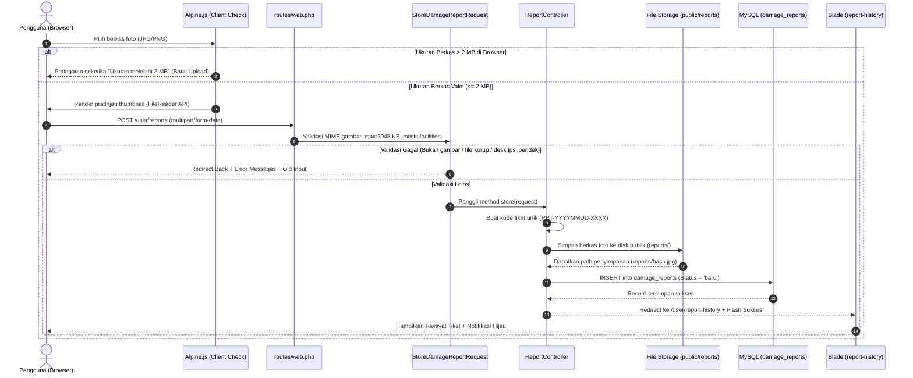

# Panduan Pembelajaran Kode: Fitur USR-04
*(Form Pelaporan Kerusakan & Malfungsi Fasilitas - CAVA)*

Dokumen ini disusun khusus sebagai **buku saku dan panduan belajar mendalam** untuk memahami 100% alur kerja, logika bisnis, keamanan unggah berkas, dan keputusan arsitektur di balik kode program fitur:
**USR-04: Form Pelaporan Kerusakan Fasilitas (Ticketing)**.

---

## 🗺️ Peta Konsep: Alur Pengaduan Tiket Kerusakan (*Request Lifecycle*)

Ketika seorang mahasiswa/dosen/staf mengisi formulir keluhan dan mengunggah foto bukti kerusakan, berikut adalah perjalanan data di balik layar:



---

## 📂 Bagian 1: Bedah Validasi Input & Keamanan Unggah Berkas

### 1.1. FormRequest: `app/Http/Requests/StoreDamageReportRequest.php`

```php
public function rules(): array
{
    return [
        'facility_id'      => ['required', 'integer', 'exists:facilities,id'],
        'category'         => ['required', 'string', 'max:100'],
        'description'      => ['required', 'string', 'min:10', 'max:1000'],
        'attachment_photo' => ['required', 'image', 'mimes:jpeg,png,jpg', 'max:2048'],
    ];
}
```

#### Mengapa Validasi Berkas Sangat Kritis?
Celah keamanan pada fitur unggah berkas (*File Upload Vulnerability*) adalah salah satu dari celah paling berbahaya (OWASP Top 10):
1. **`image`**:
   - Laravel membaca *magic bytes* (header biner) berkas untuk membuktikan berkas tersebut benar-benar sebuah gambar, bukan skrip PHP jahat yang sengaja diganti namanya menjadi `virus.php.jpg`.
2. **`mimes:jpeg,png,jpg`**:
   - Membatasi tipe MIME hanya pada format foto standar web.
3. **`max:2048`**:
   - Satuan aturan `max` untuk berkas pada Laravel adalah **Kilobyte (KB)**.
   - $2.048\text{ KB} = 2\text{ MB}$.
   - Mencegah serangan *Denial of Service* (DoS) di mana peretas mencoba menghabiskan ruang penyimpanan server lokal (*Disk Exhaustion*).
4. **`exists:facilities,id`**:
   - Memastikan bahwa ruangan yang dilaporkan benar-benar ada di tabel `facilities` kampus.
5. **`min:10`**:
   - Mencegah laporan asal-asalan seperti hanya mengetik kata *"rusak"* atau *"jelek"*. Pelapor diwajibkan menuliskan detail yang bermakna.

---

## 📂 Bagian 2: Bedah Antarmuka Dinamis (`report-form.blade.php`)

### 2.1. Atribut Wajib Formulir Unggah Berkas:
```blade
<form action="{{ route('user.reports.store') }}" method="POST" enctype="multipart/form-data">
    @csrf
```
- **`enctype="multipart/form-data"`**:
  - Secara default, form HTML mengirim data dalam format `application/x-www-form-urlencoded` yang hanya bisa membawa teks string.
  - Untuk mengirimkan aliran biner berkas foto (*binary stream*), atribut `enctype="multipart/form-data"` **mutlak wajib disertakan**. Jika lupa, `$request->file('attachment_photo')` di backend akan bernilai `null`!

### 2.2. Validasi Klien Cepat via Alpine.js (*Client-side Defense*):
```javascript
handleFile(e) {
    const file = e.target.files[0];
    if (file) {
        if (file.size > 2 * 1024 * 1024) {
            this.fileError = 'Ukuran berkas melebihi batas maksimal 2 MB...';
            e.target.value = '';
            this.imagePreview = null;
            return;
        }
        const reader = new FileReader();
        reader.onload = (event) => {
            this.imagePreview = event.target.result;
        };
        reader.readAsDataURL(file);
    }
}
```
- Menggunakan `FileReader` API peramban untuk membaca berkas lokal dan menampilkannya sebagai *data URL* (*Base64*) pada elemen `` tanpa harus mengunggahnya terlebih dahulu ke server (*Zero Network Cost*).
- Pengecekan `file.size > 2 * 1024 * 1024` langsung di peramban menghemat kuota internet pengguna dan mengurangi beban lalu lintas jaringan (*bandwidth efficiency*).

### 2.3. Retensi Data Masukan Pasca-Error:
- Kolom deskripsi menggunakan `{{ old('description') }}` agar ketikan panjang pelapor tidak hilang jika validasi server menolak foto.
- Dropdown fasilitas mengingat pilihan pengguna dengan: `{{ old('facility_id', $selectedFacilityId) == $facility->id ? 'selected' : '' }}`.

---

## 📂 Bagian 3: Bedah Logika Kontroler (`ReportController.php`)

```php
public function store(StoreDamageReportRequest $request): RedirectResponse
{
    $validated = $request->validated();
    $userId = Auth::id() ?? 1;

    // 1. Generate Kode Tiket Laporan Unik (RPT-YYYYMMDD-XXXX)
    $datePrefix = Carbon::now()->format('Ymd');
    do {
        $randomSeq  = strtoupper(substr(bin2hex(random_bytes(2)), 0, 4));
        $reportCode = sprintf('RPT-%s-%s', $datePrefix, $randomSeq);
    } while (DamageReport::where('report_code', $reportCode)->exists());

    // 2. Unggah Foto Bukti ke Storage Public Disk
    $photoPath = null;
    if ($request->hasFile('attachment_photo')) {
        $photoPath = $request->file('attachment_photo')->store('reports', 'public');
    }

    // 3. Simpan Data Tiket Pengaduan ke Database
    $report = DamageReport::create([
        'report_code'        => $reportCode,
        'user_id'            => $userId,
        'facility_id'        => $validated['facility_id'],
        'category'           => $validated['category'],
        'description'        => $validated['description'],
        'attachment_photo'   => $photoPath,
        'status'             => 'baru',
        'is_facility_locked' => false,
    ]);

    return redirect()->route('user.report-history')
        ->with('success', "Laporan kerusakan berhasil dikirim dengan kode tiket {$reportCode}...");
}
```

### Mengapa Menggunakan `$request->file(...)->store('reports', 'public')`?
1. **Penamaan Berkas Acak yang Aman (*Hashed Filename*):**
   - Laravel secara otomatis membuat nama acak unik (seperti `a8f9c2d1b5...jpg`).
   - Mencegah penimpaan file jika dua mahasiswa mengunggah foto dengan nama yang sama persis (misal: `foto.jpg`).
2. **Penyimpanan di Disk Publik:**
   - Disimpan di `storage/app/public/reports`, yang ditautkan ke `public/storage/reports` via `php artisan storage:link`.
   - Foto dapat ditampilkan secara publik kepada teknisi dan admin di dasbor mereka melalui `asset('storage/' . $report->attachment_photo)`.

---

## 🧪 Bagian 4: Bedah Pengujian Otomatis (`ReportFeatureTest.php`)

```php
test('USR-04: Pengguna berhasil mengirim laporan kerusakan dengan foto bukti valid (TC-USR04-02)', function () {
    $fakeImage = UploadedFile::fake()->create('bukti_kerusakan.jpg', 500, 'image/jpeg');

    $payload = [
        'facility_id'      => $this->facility->id,
        'category'         => 'AC & Pendingin',
        'description'      => 'Unit AC di baris depan mati total dan mengeluarkan bau hangus.',
        'attachment_photo' => $fakeImage,
    ];

    $response = $this->actingAs($this->user)->post(route('user.reports.store'), $payload);

    $response->assertRedirect(route('user.report-history'));
    $response->assertSessionHas('success');

    $this->assertDatabaseHas('damage_reports', [
        'user_id'     => $this->user->id,
        'facility_id' => $this->facility->id,
        'status'      => 'baru',
    ]);
});
```

### Catatan Teknis Pengujian Pest:
- **`UploadedFile::fake()->create('bukti.jpg', 500, 'image/jpeg')`**:
  - Digunakan untuk mensimulasikan file unggahan berukuran 500 KB tanpa bergantung pada ekstensi PHP `gd` di mesin pengembang.
- **`Storage::fake('public')`**:
  - Menyediakan direktori virtual di memori saat pengujian berlangsung, sehingga folder `storage` lokal asli tidak akan tercemar oleh foto-foto sampah uji coba.

---

## 🎓 Tanya Jawab Kunci (Persiapan Sidang / Review Dosen)

| Pertanyaan Penguji | Jawaban Teknis Terbaik Anda |
|---|---|
| *"Mengapa foto bukti tidak disimpan langsung sebagai biner (BLOB) di tabel MySQL?"* | "Menyimpan gambar langsung di database MySQL (tipe BLOB) akan menyebabkan ukuran basis data membengkak drastis (*Database Bloat*), memperlambat proses *backup/restore*, serta menghabiskan memori RAM server database. Praktik standar industri terbaik adalah menyimpan file fisik di sistem penyimpanan berkas (*File Storage Disk*) dan hanya menyimpan alamat jalurnya (*file path*) pada kolom basis data." |
| *"Bagaimana Anda mencegah celah keamanan unggah berkas (misal ada yang mencoba mengunggah shell PHP)?"* | "Pertama, kami menerapkan validasi aturan `image` dan `mimes:jpeg,png,jpg` pada `StoreDamageReportRequest` yang memeriksa header biner (*Magic Bytes*) berkas, bukan sekadar melihat ekstensi nama file. Kedua, method `store()` Laravel mengacak nama file menjadi string *hash* unik di direktori terisolasi, sehingga file tidak dapat dieksekusi langsung oleh penyerang." |
| *"Mengapa validasi ukuran maksimal 2 MB dilakukan di dua tempat (JavaScript dan PHP Laravel)?"* | "Ini adalah penerapan prinsip *Defense in Depth*. Validasi di sisi peramban (JavaScript) ditujukan untuk *User Experience* agar pengguna langsung tahu bahwa file-nya kebesaran tanpa harus menunggu proses upload yang lama. Sedangkan validasi di sisi server (Laravel) adalah benteng pertahanan mutlak (*Zero Trust*) yang tidak bisa di-bypass meskipun pengguna mematikan JavaScript atau mengirim request via cURL/Postman." |
| *"Apa arti status awal 'baru' pada tiket laporan kerusakan?"* | "Status `'baru'` adalah status awal (*Initial State*) pada alur kerja *ticketing*. Status ini menandakan bahwa laporan telah berhasil dicatat oleh sistem namun belum diinspeksi atau dialokasikan oleh Petugas Sarpras ke teknisi lapangan." |
