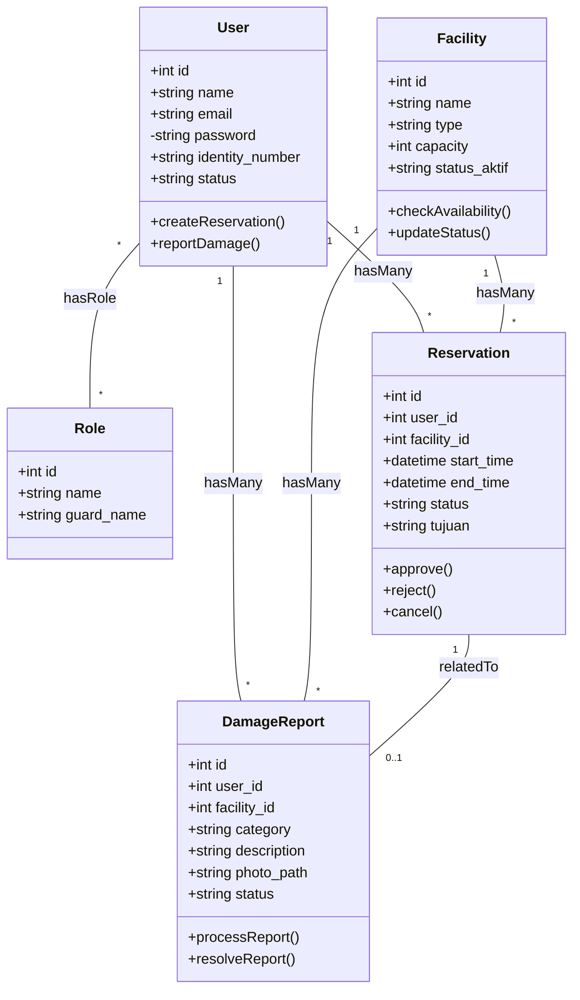
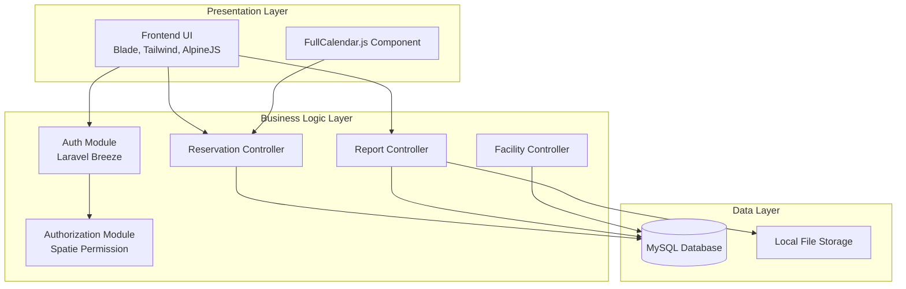
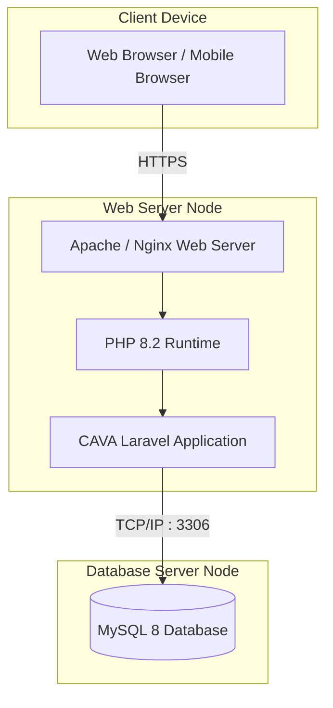
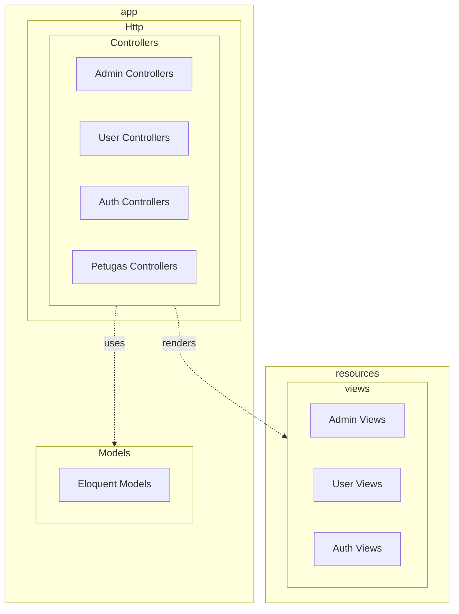

# Structural Diagrams (Diagram Struktur)

Kategori ini memodelkan elemen-elemen statis dari sistem CAVA, seperti kelas, objek, komponen, dan node fisik. Diagram-diagram di bawah ini menjadi panduan arsitektural bagi tim pengembang dalam membangun fondasi aplikasi.

## 1. Class Diagram
Class Diagram memetakan entitas basis data (Models) dan struktur pembangun sistem menggunakan prinsip Object-Oriented Programming (OOP) di Laravel.

**Penjelasan:**
- `User` berelasi dengan `Role` (melalui Spatie Permission).
- `User` memiliki banyak (`hasMany`) `Reservation` dan `DamageReport`.
- `Facility` memiliki banyak `Reservation` dan `DamageReport`.
- Menggunakan visibilitas: `+` (public), `-` (private/protected).

## 2. Component Diagram
Menggambarkan bagaimana modul-modul perangkat lunak dipecah dan bagaimana mereka saling bergantung (dependency).

**Penjelasan:**
- Sistem dibagi menjadi 3 layar (layer): Presentation (UI), Business Logic (Backend), dan Data (Database/Storage).
- Komponen Frontend bergantung pada Backend API.
- Backend bergantung pada Autentikasi (Breeze) dan Otorisasi (Spatie), serta terhubung ke MySQL.

## 3. Deployment Diagram
Memetakan arsitektur eksekusi sistem, yaitu letak instalasi komponen perangkat lunak (Artifacts) ke dalam perangkat keras (Nodes).

**Penjelasan:**
- **Client Node:** Perangkat pengguna (PC/Mobile) mengakses lewat protokol HTTPS.
- **Web Server Node:** Menjalankan sistem operasi (Linux/Windows) dengan Apache/Nginx yang menampung *source code* Laravel.
- **Database Node:** Server basis data yang beroperasi pada port 3306.

## 4. Package Diagram
Mengelompokkan elemen-elemen sistem ke dalam folder/paket tingkat tinggi untuk mengatur kompleksitas aplikasi MVC.

**Penjelasan:**
- Menggambarkan struktur MVC (Model, View, Controller) di Laravel.
- Paket `Controllers` dibagi lagi menjadi sub-paket berdasarkan aktor/domain.

