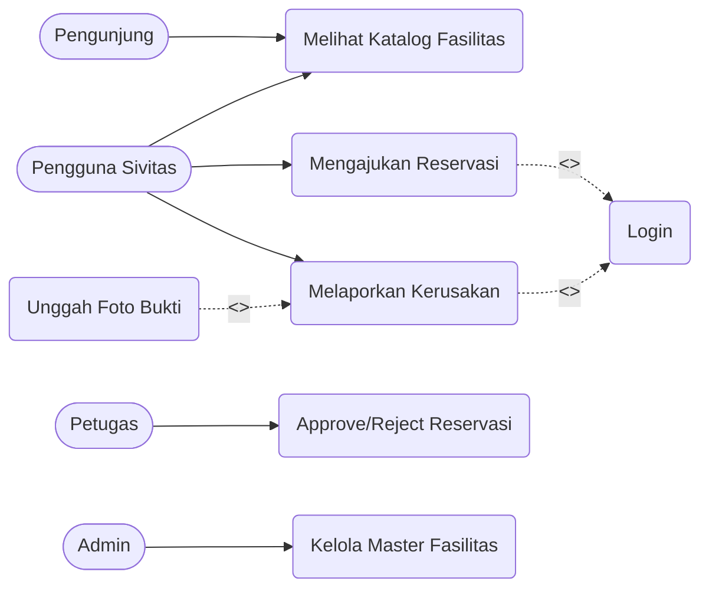
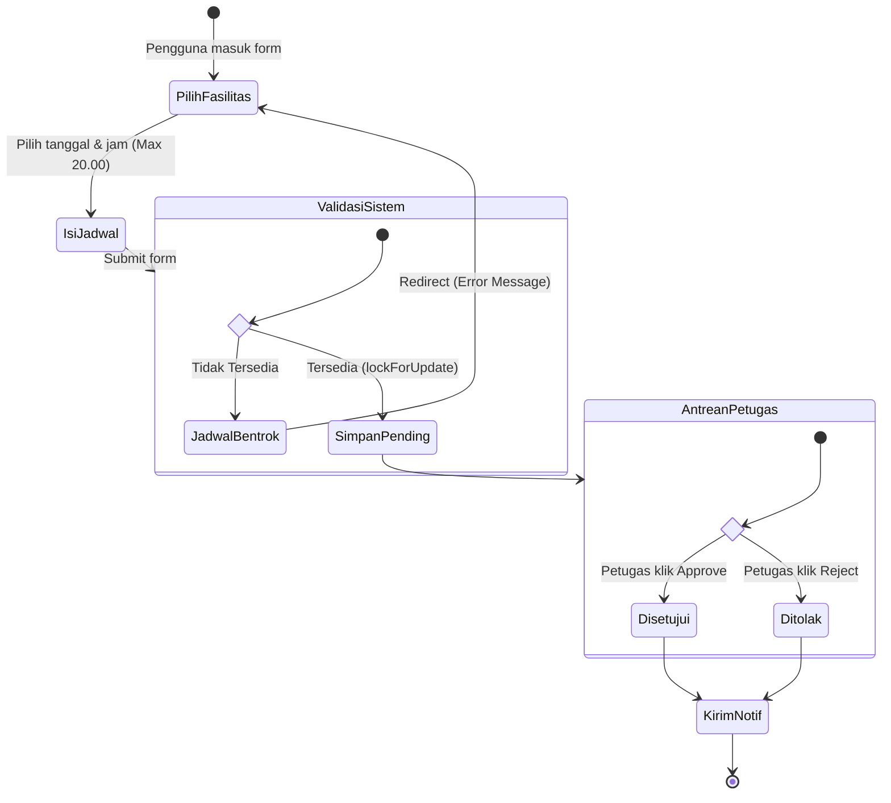
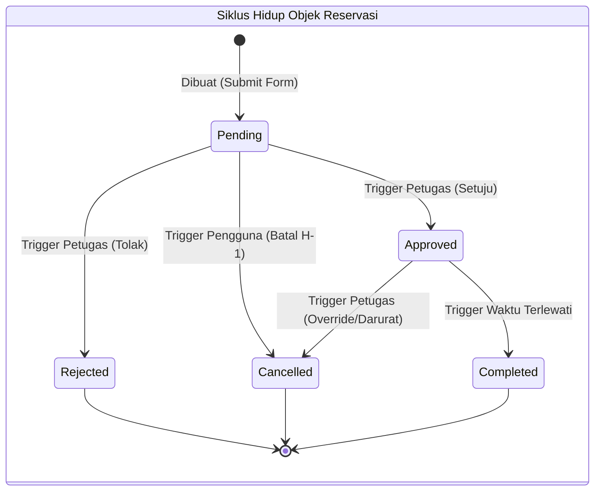
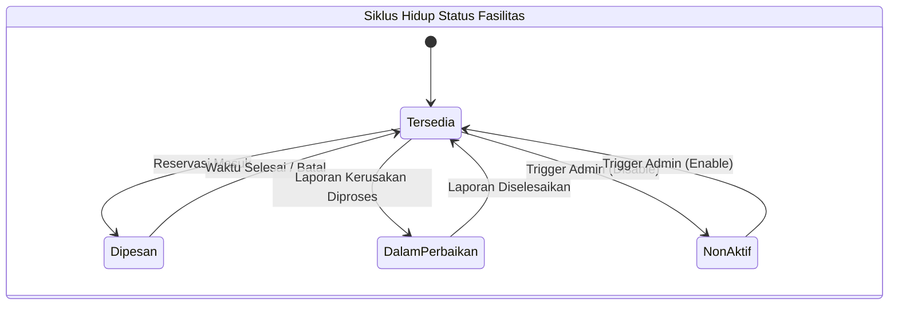

# Behavioral Diagrams (Diagram Perilaku)

Kategori ini memodelkan aspek dinamis dari sistem CAVA, yaitu interaksi pengguna, proses alur bisnis, serta siklus hidup objek seiring berjalannya waktu.

## 1. Use Case Diagram
Mendefinisikan batas ruang lingkup sistem dan fungsionalitas yang disediakan berdasarkan perspektif aktor (pengguna).

**Penjelasan:**
- Terdapat 4 aktor: `Pengunjung`, `Pengguna Sivitas`, `Petugas`, `Admin`.
- Aktor mewarisi hak akses (misal: Pengguna Sivitas juga bisa melakukan apa yang bisa dilakukan Pengunjung).
- Fitur "Mengajukan Reservasi" **wajib** (`<<include>>`) "Login".
- Fitur "Melaporkan Kerusakan" bisa diperluas (`<<extend>>`) dengan "Unggah Foto Bukti".

## 2. Activity Diagram
Memodelkan logika prosedural, aliran kerja (*workflow*), dan proses bisnis secara berurutan. Di bawah ini adalah Alur Pengajuan Reservasi.

**Penjelasan:**
- Dimulai dari pengguna memilih fasilitas dan tanggal.
- Terjadi *Decision* (Percabangan) oleh sistem untuk mengecek status ketersediaan.
- Terdapat aksi asinkron/paralel (*Fork/Join*) saat notifikasi dikirimkan kepada pengguna dan petugas setelah status diubah.

## 3. State Machine Diagram (Statechart)
Memodelkan siklus hidup (*lifecycle*) dari sebuah objek (misalnya Objek Reservasi dan Objek Laporan Kerusakan) akibat dari berbagai kejadian (*events*).

**Penjelasan:**
- Objek **Reservasi**: Status default adalah `Pending`. Jika disetujui menjadi `Approved`, jika ditolak menjadi `Rejected`. Reservasi bisa di-batal mandiri menjadi `Cancelled`.
- Objek **Fasilitas**: Berubah dari `Tersedia` menjadi `Dalam Perbaikan` jika ada pelaporan yang disetujui.

