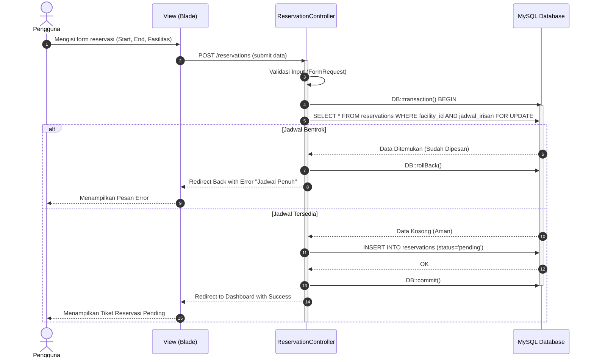
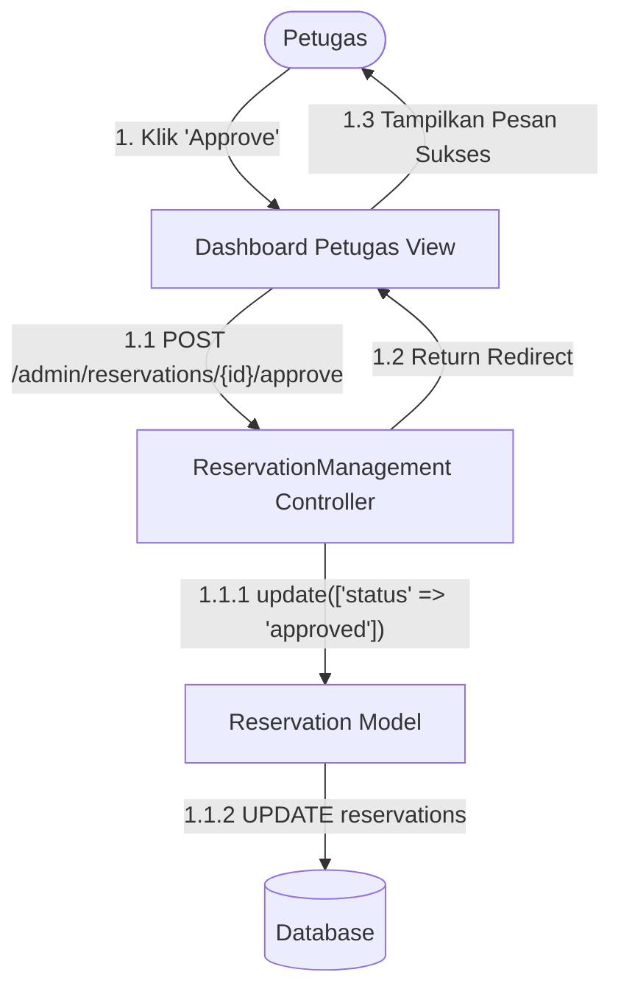
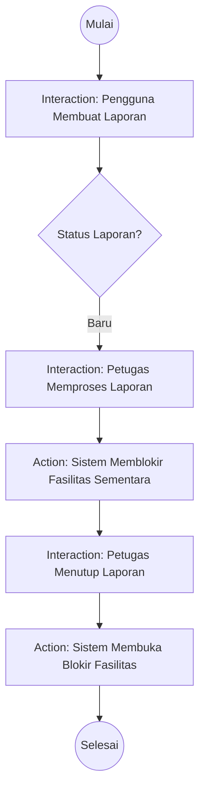

# Interaction Diagrams (Diagram Interaksi)

Kategori ini merupakan sub-bagian dari Behavioral Diagrams yang berfokus pada pertukaran pesan antar objek, fungsi, atau entitas sistem secara teknikal dan sekuensial.

## 1. Sequence Diagram
Diagram interaksi terpenting bagi *developer*. Menggambarkan urutan kejadian berdasarkan garis waktu (vertikal) dan pesan yang dikirim (horizontal).

**Skenario: Pengajuan Reservasi Anti-Bentrok (Concurrency Lock)**
**Penjelasan:**
- Memetakan pergerakan request dari `User` ke `Controller` ke `Database` dan membalikkan respon.
- Menunjukkan aktivasi fungsi `lockForUpdate()` di dalam *database transaction* untuk mengunci baris data agar tidak terjadi *double-booking* saat *concurrent request*.

## 2. Communication Diagram (Peta Interaksi)
Fokus pada struktur spasial atau peta koneksi jaringan antar objek (menggunakan penomoran) alih-alih urutan waktu linear.

**Skenario: Persetujuan Reservasi oleh Petugas**
**Penjelasan:**
- Interaksi dimulai dari Petugas (1).
- Panggilan berurutan ke Controller (1.1), Model (1.1.1), Database (1.1.2), lalu kembali ke View (1.2).

## 3. Interaction Overview Diagram (Gambaran Besar Interaksi)
Menunjukkan gambaran besar aliran kontrol yang menggabungkan elemen *Activity Diagram* dengan *Sequence Diagram*.

**Skenario: Siklus Laporan Kerusakan**
**Penjelasan:**
- Menggambarkan tiga tahap besar: `Pembuatan Laporan`, `Pemrosesan Laporan`, dan `Penyelesaian Laporan`.
- Masing-masing node mewakili blok interaksi yang bisa dibedah menjadi *Sequence Diagram* tersendiri.

