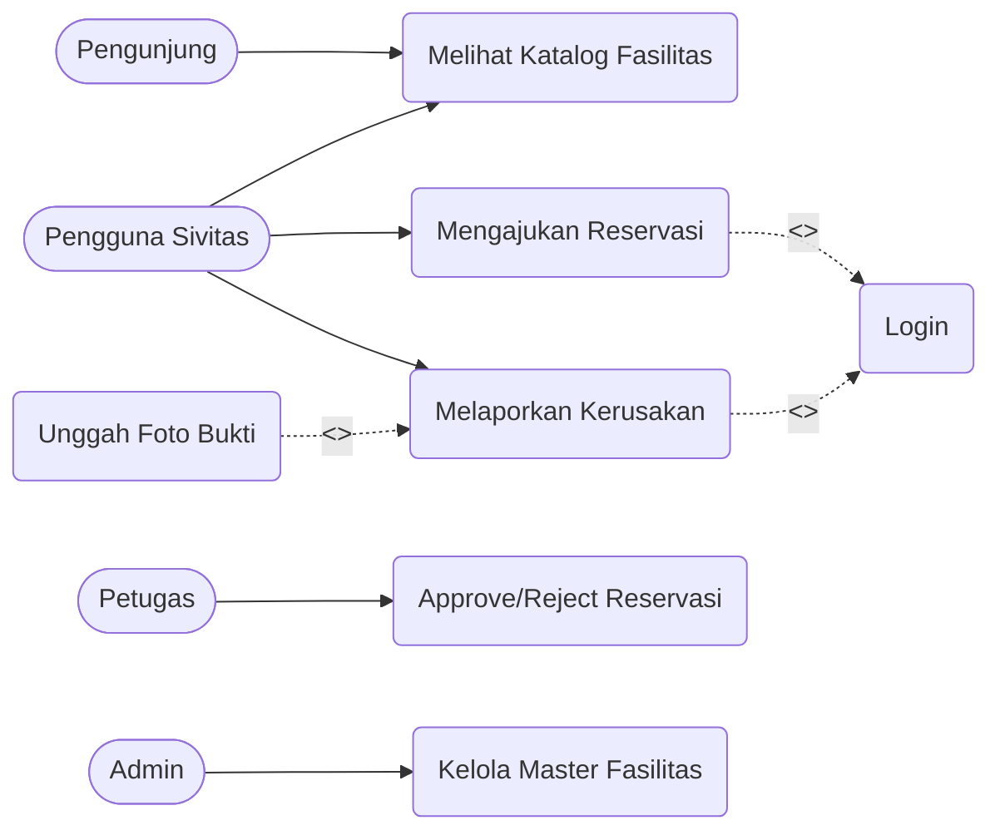

# 05. Use Case Diagram

## Tujuan
Memvisualisasikan interaksi fungsionalitas (*Use Case*) dari sudut pandang para pengguna akhir (*Actors*) di batas sistem yang kita bangun.

## Detail Penjelasan Tiap Komponen

### 1. Aktor (Actors)
Aktor merepresentasikan siapa saja entitas yang menggunakan sistem.
- **`Pengunjung (Guest)`**: Pihak luar (publik) yang belum mendaftar. Hak akses terlemah.
- **`Pengguna Sivitas (User)`**: Mahasiswa/Dosen/Staf yang telah mendaftar. Aktor ini mewarisi seluruh kapabilitas Pengunjung (bisa juga melihat kalender publik).
- **`Petugas (Officer)`**: Eksekutor lapangan. Menyetujui reservasi dan menyelesaikan perbaikan fasilitas.
- **`Admin`**: Otoritas tertinggi. Mewarisi peran Petugas, namun memiliki wewenang untuk melihat rekapitulasi data (statistik) dan mengubah data master.

### 2. Use Cases (Fungsi Sistem)
Fungsi-fungsi yang disediakan oleh CAVA:
- **`Melihat Katalog Fasilitas`**: Dapat diakses tanpa login.
- **`Login`**: Menjadi syarat wajib bagi fungsi-fungsi khusus.
- **`Mengajukan Reservasi`**: Harus dilakukan oleh akun Pengguna Sivitas.
- **`Melaporkan Kerusakan`**: Fitur Ticketing Pengguna.
- **`Approve/Reject Reservasi`**: Wewenang mutlak Petugas.
- **`Kelola Master Fasilitas`**: Hak khusus Admin.

### 3. Relasi Khusus `<<include>>` dan `<<extend>>`
- **`<<include>>` (Kondisi Wajib):** Saat Pengguna mengklik "Mengajukan Reservasi" atau "Melaporkan Kerusakan", mereka secara mutlak akan diwajibkan melewati Use Case `Login`. Jika tidak Login, fungsionalitas ini tidak mungkin dijalankan.
- **`<<extend>>` (Kondisi Opsional):** Pada saat membuat "Laporan Kerusakan", sistem memberikan ekstensi fitur "Unggah Foto Bukti". Pengguna bisa menyertakan foto (opsional/tambahan), namun proses pelaporan utama tetap berjalan walau tanpa foto.

---

## Kode Diagram Mermaid

