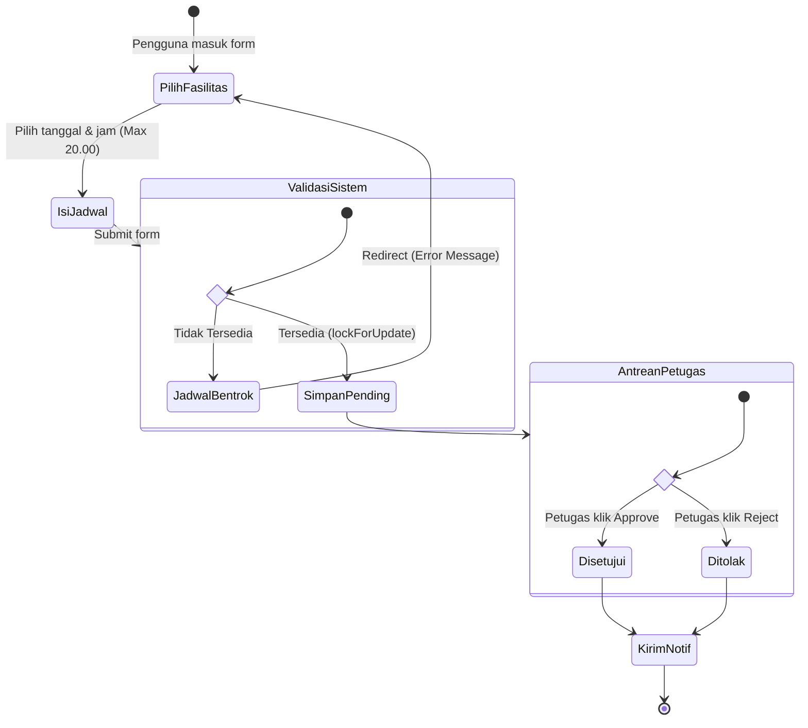

# Activity Diagram (Alur Reservasi CAVA)

## Tujuan
Memodelkan logika prosedural, *workflow* operasional, dan arah pergerakan aktivitas dari awal pengguna masuk hingga reservasi selesai.

## Detail Penjelasan Tiap State (Aktivitas)

### 1. Blok Aktivitas Pengguna (Awal)
- **`PilihFasilitas`**: State pertama di mana pengguna berada di form reservasi dan menyeleksi fasilitas dari dropdown.
- **`IsiJadwal`**: State memasukkan `start_time` dan `end_time`. Terdapat logika *Guard Condition* (Syarat): Maksimal operasional jam 20.00 dan wajib kelipatan 30 menit. Jika gagal, input ditolak sebelum ke server.

### 2. Blok `ValidasiSistem` (Percabangan Keputusan)
Ini merepresentasikan logika Controller di *Backend*.
- Terdapat blok simbol intan (Choice/Decision) `if_state`.
- **Cabang `JadwalBentrok`**: Jika *database* mendeteksi irisan waktu pada ruangan yang sama. Sistem akan memantulkan pengguna kembali ke `PilihFasilitas` dengan pesan ralat (error).
- **Cabang `SimpanPending`**: Jika jadwal kosong, sistem berhasil melakukan injeksi data dengan state awal `Pending`.

### 3. Blok `AntreanPetugas` (Eksekutor)
Reservasi masuk ke dasbor persetujuan. Petugas dihadapkan pada persimpangan keputusan (Choice `approve_choice`).
- **`Disetujui`**: Tombol Approve ditekan. State reservasi berubah.
- **`Ditolak`**: Tombol Reject ditekan.

### 4. Aktivitas Akhir (`KirimNotif`)
Apapun hasil keputusannya (Disetujui/Ditolak), alur konvergen (mengumpul) kembali pada fungsi paralel, yakni *Trigger* pengiriman email/notifikasi kepada peminjam.

---

## Kode Diagram Mermaid

