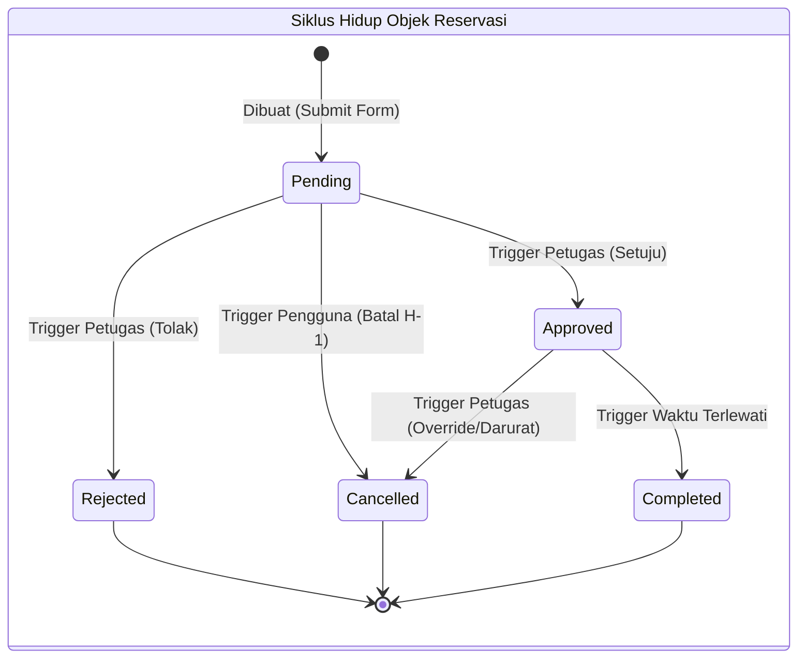

# 07. State Machine Diagram: Objek Reservasi

## Tujuan
Memvisualisasikan seluruh kemungkinan fase (*states*) dari satu tiket Reservasi di *database*, serta kejadian/pemicu (*triggers*) apa saja yang mampu mengubah fase tersebut.

## Detail Penjelasan Tiap State & Transisi (Triggers)

### 1. State Awal (`Pending`)
Saat pengguna menekan submit dan sistem berhasil menyimpannya, tiket terlahir dengan status ini. Di fase ini, tiket belum sah digunakan.

- **Trigger ke `Approved`**: Terjadi ketika Petugas menekan tombol "Approve" di dasbornya. Tiket resmi di-ACC.
- **Trigger ke `Rejected`**: Terjadi ketika Petugas menekan tombol "Tolak" karena alasan tertentu (misal: acara tidak diizinkan). Status mati dan masuk kotak riwayat.
- **Trigger ke `Cancelled`**: Terjadi karena **Aksi Pengguna (Pembatalan Mandiri)**. Syarat wajib (*guard*): Peminjam hanya bisa membatalkan mandiri **Maksimal H-1** sebelum `start_time`.

### 2. State Lanjutan (`Approved`)
Tiket telah disahkan dan waktu fasilitas telah diamankan.

- **Trigger ke `Cancelled`**: Lho, kok bisa dibatalkan lagi? Ya, ini adalah fitur **Override (Pembatalan Darurat)**. Petugas memiliki otoritas absolut untuk membatalkan tiket yang sudah disetujui jika terjadi kondisi mendadak (misal: ruang kebanjiran, AC mati).
- **Trigger ke `Completed`**: Transisi otomatis oleh sistem. Terjadi ketika waktu dunia nyata telah melewati `end_time` dari jadwal tiket, yang menandakan fasilitas selesai digunakan tanpa kendala.

### 3. State Final (`Rejected`, `Cancelled`, `Completed`)
Siklus hidup objek berakhir (`[*]`). Status-status ini tidak akan bisa berbalik lagi menjadi `Pending` atau `Approved`.

---

## Kode Diagram Mermaid

