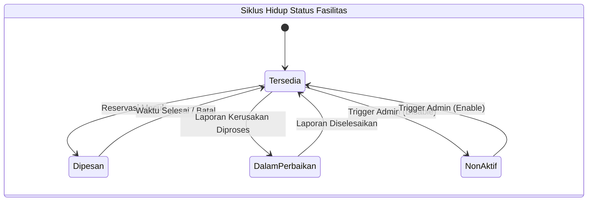

# 08. State Machine Diagram: Objek Fasilitas

## Tujuan
Memetakan pergerakan status pada *Master Data* Ruangan/Aset, dan bagaimana aktivitas eksternal (seperti pelaporan kerusakan) mempengaruhi ketersediaan ruangan tersebut di kalender publik.

## Detail Penjelasan Tiap State & Transisi (Triggers)

### 1. State `Tersedia` (Default)
Status normal. Menandakan ruang bersih, alat lengkap, dan dapat dipilih di form reservasi.

- **Transisi ke `Dipesan`**: Muncul otomatis di sistem penanggalan (*FullCalendar*) ketika ada pengguna yang transaksinya di-Approve pada jam tersebut.
- **Transisi Kembali**: Jika durasi peminjaman selesai, secara maya fasilitas kembali `Tersedia`.

### 2. State `Dalam Perbaikan` (Maintenance)
- **Trigger `Laporan Kerusakan Diproses`**: Ini adalah fitur unggulan sistem. Jika ada mahasiswa melapor "Proyektor di Aula mati", lalu Petugas mengklik "Sedang Diperbaiki" pada tiket laporan tersebut, maka secara *Otomatis (Event Observer)* status Aula berubah menjadi `Dalam Perbaikan`.
- **Efek Samping**: Seluruh *slot* kalender pada ruang ini akan diarsir/di-blok (tidak bisa diklik pengguna manapun).
- **Transisi Kembali**: Begitu Teknisi mengklik "Laporan Selesai", blokir terbuka dan ruang kembali `Tersedia`.

### 3. State `NonAktif` (Disabled)
- **Trigger `Admin (Disable)`**: Merupakan wewenang eksklusif Admin lewat fitur kelola fasilitas. Fasilitas dimatikan dari peredaran selamanya (misalnya karena gedung dirubuhkan atau dialihfungsikan menjadi kantin). 
- **Transisi Kembali**: Admin secara manual mengklik tombol *Enable/Restore*.

---

## Kode Diagram Mermaid

