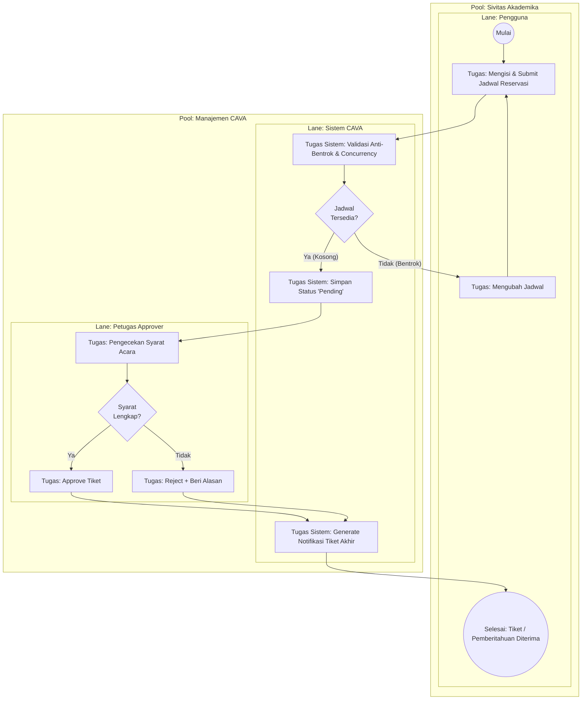

# 09. BPMN: Manajemen Reservasi Fasilitas (Core Process)

## Tujuan
Memvisualisasikan alur bisnis (Business Process Model and Notation) paling utama di CAVA menggunakan partisi pihak yang terlibat (Pools & Lanes) dari awal form di-submit hingga tiket diterbitkan/ditolak.

## Analisis Komponen BPMN

### 1. Peserta Utama (Pools & Lanes)
- **Pool 1: Sivitas Akademika**
  - **Lane:** Pengguna (Orang yang butuh ruangan).
- **Pool 2: Manajemen CAVA**
  - **Lane Atas:** Sistem CAVA (Aktor Otomatis / Backend).
  - **Lane Bawah:** Petugas (Approver Manusia).

### 2. Penjelasan Peristiwa (Events) & Tugas (Tasks)
- **(Start Event) Akses Form:** Pengguna masuk ke halaman pemesanan.
- **(Task) Submit Jadwal:** Pengguna memilih ruang dan waktu. Pesan dikirim menyeberang ke Lane Sistem.
- **(Task & Gateway) Pengecekan Sistem:** Sistem melakukan `lockForUpdate`. Terdapat **Exclusive Gateway (Simbol X)**. 
  - Jika jadwal irisan (Bentrok) ➔ Tolak langsung, arahkan pengguna ubah jadwal.
  - Jika kosong ➔ Ubah status jadi 'Pending' dan lempar notifikasi ke dasbor Petugas.
- **(Task & Gateway) Penilaian Petugas:** Petugas mengecek tiket di antrean. Bertemu Exclusive Gateway lagi.
  - Setuju ➔ Status 'Approved'.
  - Tolak ➔ Status 'Rejected' + Catatan.
- **(End Event) Selesai:** Tiket diterbitkan/dikirim via Email ke Pengguna. Siklus tertutup.

---

## Kode Diagram Mermaid (Gaya Flowchart Lintas-Lane)

*Catatan: Mermaid.js belum memiliki blok khusus BPMN 2.0 secara resmi, namun struktur Pools & Lanes direpresentasikan sempurna melalui subgraph bersarang pada Flowchart LR/TD.*

