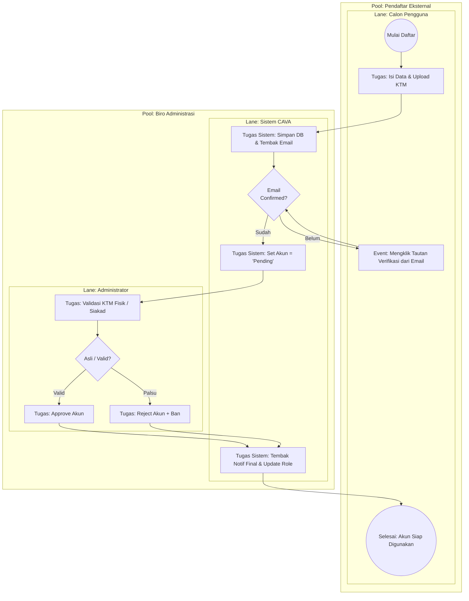

# 11. BPMN: Verifikasi Keanggotaan Pendaftar (Admin Process)

## Tujuan
Memvisualisasikan alur bisnis pendaftaran (*onboarding*) pengguna baru ke dalam platform CAVA. Karena sistem ini terbatas pada lingkup internal kampus, pendaftaran mandiri wajib di-validasi agar orang luar tidak menyusup.

## Analisis Komponen BPMN

### 1. Peserta Utama (Pools & Lanes)
- **Pool 1: Pendaftar Eksternal**
  - **Lane:** Pengguna Baru.
- **Pool 2: Administrasi Akun**
  - **Lane Atas:** Sistem CAVA (Otomasi Email & State).
  - **Lane Bawah:** Admin (Verifikator Dokumen/KTM).

### 2. Penjelasan Peristiwa (Events) & Tugas (Tasks)
- **(Start Event) Registrasi:** Pengguna baru mengisi form, NIM/NIP, password, dan wajib mengunggah KTM.
- **(Task & Intermediate Event) Verifikasi Email:** Sistem memaksa pendaftar berada dalam *State 'Unverified Email'*. Sistem mengirim OTP/Link. Pengguna harus membuka emailnya dan mengklik tautan (Loop/Gateway).
- **(Task) Antrean Admin (Status: Pending):** Jika email sahih, akun naik tingkat menjadi "Pending". Pengguna masih belum bisa pinjam ruangan.
- **(Task & Gateway) Verifikasi Manusia (Admin):** Admin mengecek silang kecocokan wajah/NIM di KTM dengan pangkalan data SIAKAD manual. 
  - Valid ➔ Ubah ke 'Active'.
  - Palsu ➔ Ubah ke 'Rejected' + Catatan.
- **(End Event) Akses Terbuka:** Akun siap digunakan untuk login dan reservasi.

---

## Kode Diagram Mermaid

