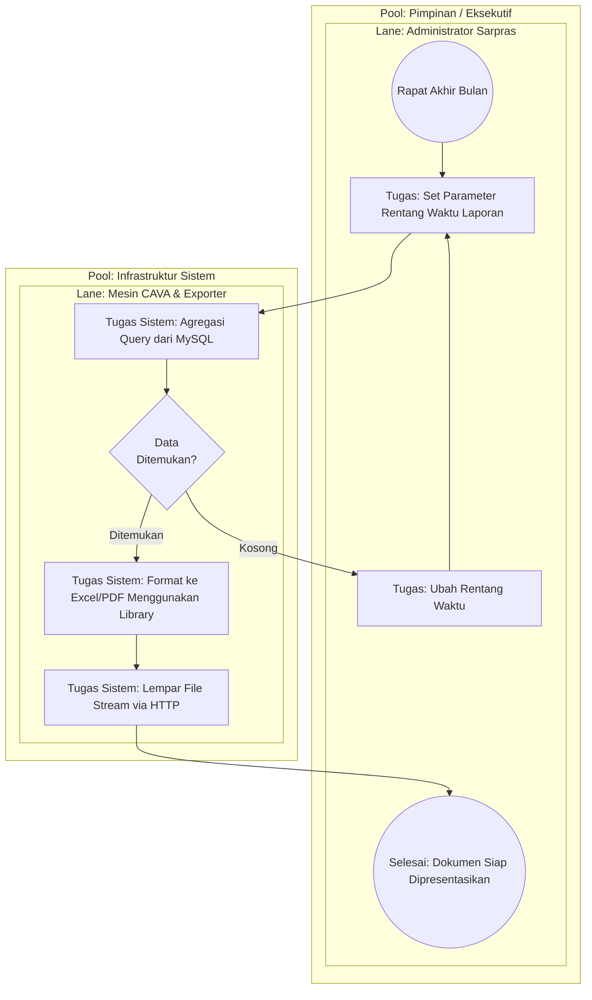

# BPMN: Pelaporan & Audit Data (Executive Process)

## Tujuan
Memvisualisasikan alur bisnis tingkat atas (*Executive/Managerial*) yang berfokus pada ekstraksi, rekapitulasi, dan audit data. Proses ini tidak mengubah status fasilitas, tetapi memproduksi artefak administrasi fisik/digital (laporan Excel/PDF).

## Analisis Komponen BPMN

### 1. Peserta Utama (Pools & Lanes)
- **Pool 1: Eksekutif CAVA**
  - **Lane:** Admin (Biro Sarana Prasarana / Pengambil Keputusan).
- **Pool 2: Infrastruktur Sistem**
  - **Lane:** Sistem CAVA (Mesin *Query* dan *Exporter*).

### 2. Penjelasan Peristiwa (Events) & Tugas (Tasks)
- **(Start Event) Kebutuhan Audit:** Timbulnya kebutuhan dari manajemen kampus di akhir bulan untuk melihat laporan tingkat kerusakan aset.
- **(Task) Konfigurasi Laporan:** Admin membuka dasbor statistik, memilih rentang waktu (misal: 1 Jan - 31 Jan), dan menekan tombol *Generate Excel*.
- **(Task & Gateway) Query Database:** Sistem menyeberang ke *layer* data.
  - Jika data kosong (tidak ada reservasi/kerusakan bulan itu) ➔ Gateway memantul dengan notifikasi "Tidak Ada Data".
  - Jika data tersedia ➔ Sistem mengagregasi (*GROUP BY*) data, misal menghitung fasilitas mana yang paling sering rusak.
- **(Task) Konversi Dokumen:** Sistem menggunakan *library* `Laravel-Excel` atau `DomPDF` untuk memformat data mentah SQL menjadi baris-baris *spreadsheet*.
- **(End Event) File Diunduh:** *Browser* admin mengunduh dokumen, dan dokumen tersebut siap dipresentasikan di rapat biro. Siklus selesai.

---

## Kode Diagram Mermaid

