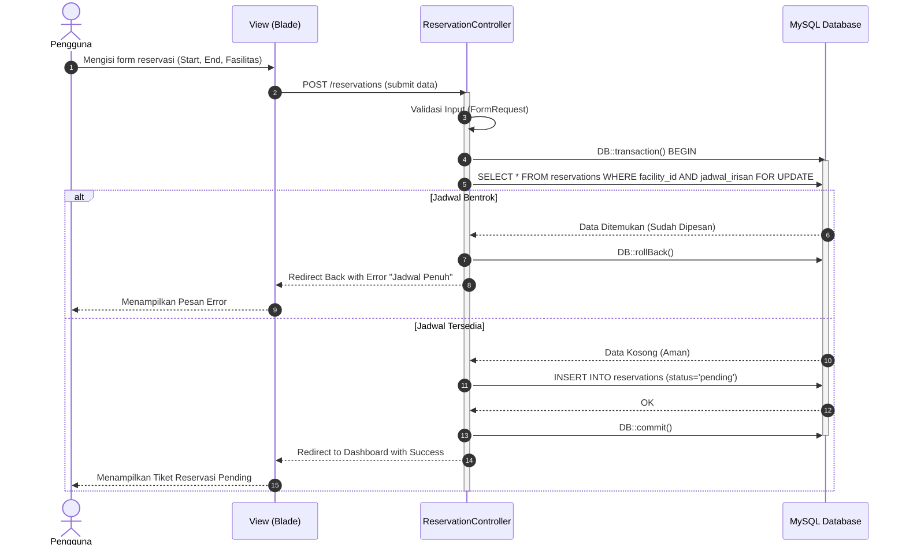

# 09. Sequence Diagram: Reservasi Anti-Bentrok

## Tujuan
Membedah alur waktu berjalannya kode secara sekuensial. Diagram ini dirancang sangat teknis khusus untuk *Backend Developer*, yang menyoroti pergerakan pesan dari lapisan `View` ke `Database` dan kembali.

## Detail Penjelasan Tiap Lifeline & Proses

### 1. Lifeline Aktor & Modul
- **`Pengguna`**: Pemegang kendali (*Trigger*) dari sisi antarmuka.
- **`View (Blade)`**: Halaman form (`reservasi.blade.php`).
- **`ReservationController`**: Pengendali utama. Ini dilengkapi dengan *Activation Bar* (kotak tebal pada garis waktu) yang menunjukkan lamanya blok kode ini beroperasi menyita memori server.
- **`MySQL Database`**: Komponen persisten.

### 2. Penjelasan Alur Pesan (Messages)
- **Message 1 & 2**: Pengguna mengirim input lewat form yang langsung dibungkus sebagai `POST /reservations`.
- **Message 3 (`Validasi Input`)**: Controller memanggil fungsi internal (FormRequest) secara sinkron (Self-call) untuk mengecek apakah jam masuk akal (misal start < end).
- **Message 4 (`DB::transaction() BEGIN`)**: Memulai pembatasan *transaction*. Segala perubahan selanjutnya dihentikan sementara di ruang maya.
- **Message 5 (`SELECT ... FOR UPDATE`)**: Inilah roh utama anti-bentrok. Controller memerintahkan DB untuk mengunci (*lock*) catatan fasilitas terkait hingga transaksi ini selesai. 
- **Blok Alternatif (`alt Jadwal Bentrok`)**:
  - *Skenario A (Gagal)*: Fasilitas sudah di- *booking* milidetik sebelumnya. DB membalikkan pesan gagal. Controller merespons dengan `DB::rollBack()` (membatalkan segalanya) dan melempar *error* ke antarmuka.
  - *Skenario B (Tersedia)*: Lolos. Data dimasukkan (`INSERT`) dengan status `Pending`. Diakhiri dengan `DB::commit()` untuk menyimpan permanen ke disk, lalu melepas kuncian ruang maya.

---

## Kode Diagram Mermaid

