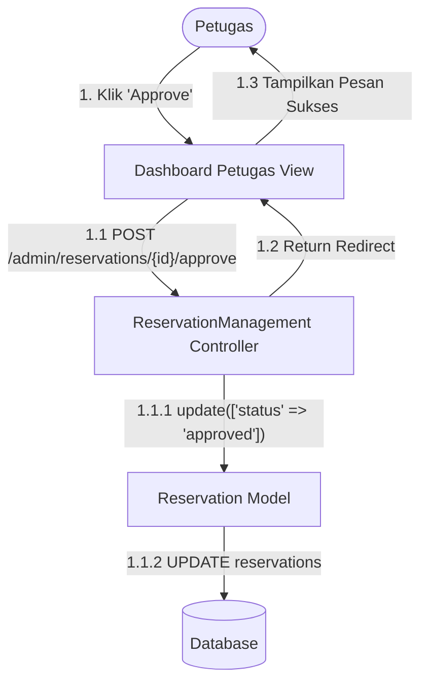

# 10. Communication Diagram: Persetujuan Reservasi

## Tujuan
Berbeda dengan Sequence Diagram yang memanjang ke bawah berdasarkan waktu, Communication Diagram fokus memetakan jarak koneksi spasial antar objek secara struktural (seperti jaring laba-laba).

## Detail Penjelasan Urutan Pesan Berdasarkan Hierarki Angka

### 1. Pesan Induk (`1. Klik 'Approve'`)
- Dimulai saat `Petugas` berinteraksi dengan `Dashboard Petugas View`.

### 2. Rentetan Interaksi Layer (Nested 1.1)
- **`1.1 POST /admin/reservations/{id}/approve`**: Setelah diklik, View meneruskan sinyal HTTP menuju `ReservationManagement Controller`.
- **`1.1.1 update(['status' => 'approved'])`**: Controller mengeksekusi metode pembaruan (update) milik `Reservation Model`. (Ini adalah pesan anak dari 1.1).
- **`1.1.2 UPDATE reservations`**: Model Eloquent Laravel akhirnya mengeksekusi query raw MySQL (`UPDATE`) langsung ke `Database`.

### 3. Rentetan Respon Penutup (`1.2` & `1.3`)
- Setelah interaksi 1.1 selesai tanpa *error*, rantai komunikasi berpindah memutar kembali.
- **`1.2 Return Redirect`**: Controller menyuruh View untuk me-refresh dirinya sendiri.
- **`1.3 Tampilkan Pesan Sukses`**: View menampilkan kotak hijau (flash message) kepada sang Petugas yang menandakan tiket sukses disetujui.

---

## Kode Diagram Mermaid

