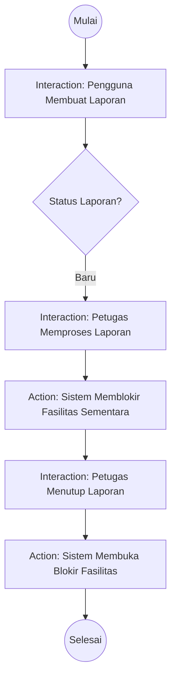

# 11. Interaction Overview Diagram: Pelaporan Kerusakan

## Tujuan
Menyatukan gambaran besar proses operasional bisnis (mirip Activity Diagram) namun menekankan bahwa tiap kotak proses tersebut adalah sebuah rangkaian "Interaction" atau komunikasi antar kelas di baliknya.

## Detail Penjelasan Tiap Tahap (Node)

### Tahap 1: Lapor
- **`Interaction: Pengguna Membuat Laporan`**: Kotak (node) ini sebenarnya mewakili sebuah Sequence Diagram yang panjang (di mana Pengguna mengirim form foto, Controller memvalidasi Size 2MB, menaruh foto di Storage Local, dan meng-INSERT ke database dengan status `Baru`).

### Tahap 2: Pengecekan & Pemrosesan
- **`Cek Status Laporan`**: Simbol Decision. Sistem atau petugas mengecek tiket-tiket baru.
- **`Interaction: Petugas Memproses Laporan`**: Node yang mewakili aksi Petugas mengklik tombol "Sedang Ditangani".

### Tahap 3: Otomatisasi (Action System)
- **`Action: Sistem Memblokir Fasilitas Sementara`**: Node yang merujuk pada `Observer Pattern` atau event listener otomatis di latar belakang yang seketika mengubah status ketersediaan fasilitas tanpa klik tambahan dari manusia. (Fasilitas berubah *State*-nya dari `Tersedia` menjadi `Dalam Perbaikan`).

### Tahap 4: Penyelesaian
- **`Interaction: Petugas Menutup Laporan`**: Mewakili Sequence Diagram ketika petugas mencatat rangkuman perbaikan dan klik "Selesai".
- **`Action: Sistem Membuka Blokir`**: Latar belakang sistem mengembalikan fasilitas ke kalender publik.

---

## Kode Diagram Mermaid

