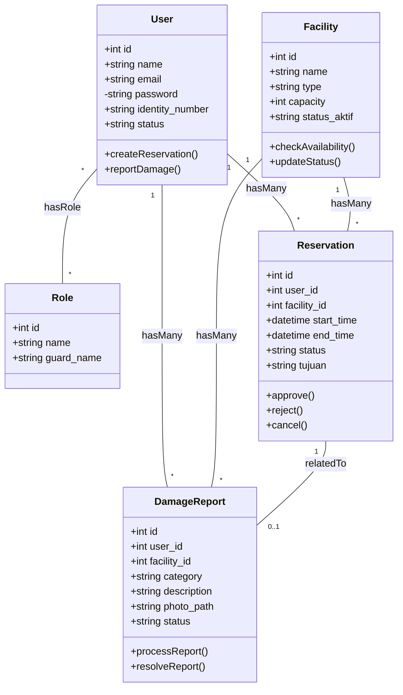

# 01. Class Diagram (Sistem Reservasi & Pelaporan CAVA)

## Tujuan
Class diagram ini memetakan secara detail setiap model (entitas) utama yang digunakan di dalam sistem backend Laravel, beserta relasi dan hak akses pada atributnya. 

## Detail Penjelasan Tiap Komponen & Entitas

### 1. Entitas `User`
Tabel ini menyimpan data pengguna sivitas kampus, pengunjung yang mendaftar, serta petugas.
- **`+int id`**: Primary Key (Public).
- **`+string name`**: Nama lengkap pengguna.
- **`+string email`**: Harus unik, selalu divalidasi dengan format lowercase saat registrasi.
- **`-string password`**: Diberi tanda minus (`-`) yang berarti **Private**. Atribut ini tidak boleh diekspos secara publik dan di-hash oleh sistem (Bcrypt).
- **`+string identity_number`**: NIM (Mahasiswa) atau NIP/NIDN (Dosen/Staf).
- **`+string status`**: (`active`, `pending`, `rejected`) menandakan apakah akun tersebut diizinkan untuk login atau masih menunggu persetujuan Admin.
- **Method `createReservation()`**: Fungsi bisnis untuk mengajukan peminjaman.
- **Method `reportDamage()`**: Fungsi bisnis untuk membuat laporan kerusakan.

### 2. Entitas `Role` (Spatie)
- Model bawaan dari library `Spatie Permission`.
- **`+string guard_name`**: Mendefinisikan guard auth (contoh: `web`). Digunakan untuk mengunci akses URL.

### 3. Entitas `Facility`
Menyimpan data *master* ruangan atau barang yang bisa dipinjam atau dilaporkan.
- **`+string status_aktif`**: Status operasional keseluruhan aset.
- **Method `checkAvailability()`**: Logika kustom untuk memverifikasi apakah pada tanggal/jam tertentu fasilitas ini sedang dipinjam atau tidak.

### 4. Entitas `Reservation`
Tabel transaksi peminjaman. Sangat krusial karena mengandung status waktu.
- **`+datetime start_time` / `end_time`**: Waktu pinjam, yang mana harus kelipatan 30 menit.
- **Method `approve()` / `reject()` / `cancel()`**: Mengubah state transisi persetujuan tiket peminjaman.

### 5. Entitas `DamageReport`
Tabel transaksi pengaduan kerusakan.
- **`+string photo_path`**: Lokasi absolut penyimpanan file gambar di local storage.
- **Method `resolveReport()`**: Fungsi di mana Petugas memasukkan log perbaikan.

## Penjelasan Relasi (Kardinalitas)
- **`User "1" -- "*" Reservation`**: Hubungan **One-to-Many**. Satu pengguna bisa membuat banyak reservasi.
- **`Facility "1" -- "*" Reservation`**: Hubungan **One-to-Many**. Satu ruangan bisa dipinjam berkali-kali pada waktu yang berbeda.
- **`Reservation "1" -- "0..1" DamageReport`**: Hubungan **One-to-Zero-or-One**. Sebuah pelaporan kerusakan tidak selalu terkait dengan tiket reservasi sebelumnya, tetapi jika ada, hanya terkait dengan satu tiket spesifik.

---

## Kode Diagram Mermaid

