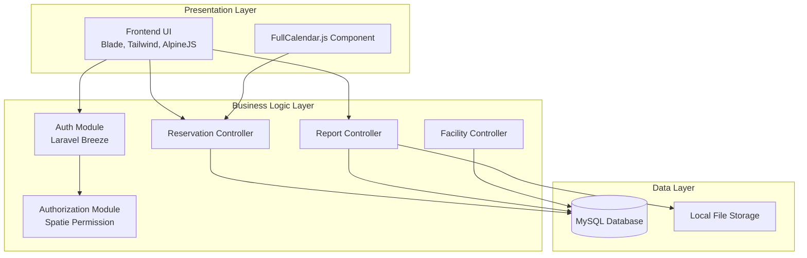

# 02. Component Diagram

## Tujuan
Memvisualisasikan pemecahan modul perangkat lunak (modularity) dalam sistem CAVA dan bagaimana tiap-tiap komponen berinteraksi atau bergantung pada komponen lainnya.

## Detail Penjelasan Tiap Lapisan (Layer)

### 1. Presentation Layer (Antarmuka Pengguna)
Ini adalah lapisan yang diakses dan dilihat langsung oleh Pengguna, Admin, maupun Petugas di browser mereka.
- **`Frontend UI (Blade, Tailwind, AlpineJS)`**: Kesatuan antarmuka. Blade merender HTML, Tailwind memperindah tampilan, dan AlpineJS mengontrol interaksi dinamis (seperti modal, dropdown) tanpa perlu memuat ulang halaman.
- **`FullCalendar.js`**: Pustaka eksternal berbasis JavaScript yang dipasang secara spesifik untuk memvisualisasikan kalender kotak-kotak. Komponen ini memiliki tanggung jawab independen untuk merender jadwal dengan memanggil data JSON.

### 2. Business Logic Layer (Logika Sistem & API)
Lapisan otak di server (Backend Laravel).
- **`Auth Module (Laravel Breeze)`**: Modul siap pakai yang mengendalikan pendaftaran, form login, enkripsi password, dan manajemen sesi browser.
- **`Authorization Module (Spatie Permission)`**: Modul yang menahan rute atau menampilkan menu berbeda berdasarkan siapa yang sedang login. Modul ini selalu dipanggil sesaat setelah `Auth Module` memberikan akses.
- **`Reservation Controller` & `Report Controller`**: Unit pemroses (*Processor*) utama yang melakukan *business validation*, termasuk pengecekan bentrok jadwal.

### 3. Data Layer (Penyimpanan)
- **`MySQL Database`**: Tempat penyimpanan data relasional (tabel).
- **`Local File Storage`**: Modul disk `Storage` bawaan Laravel yang difungsikan untuk menyimpan file gambar (KTM, Foto Kerusakan) di folder `storage/app/public`. Controller akan berinteraksi dengan komponen ini untuk menaruh (*put*) atau mengambil data media.

## Ketergantungan (Dependencies)
- **UI ➔ Auth ➔ RBAC**: Pengguna tidak dapat mengakses sistem tanpa melewati `Auth` dan divalidasi oleh `RBAC`.
- **Controllers ➔ DB**: Semua unit pemroses menyimpan atau membaca data dari `MySQL`.
- **Report Controller ➔ Storage**: Secara eksklusif `ReportController` membutuhkan komponen penyimpanan disk.

---

## Kode Diagram Mermaid

