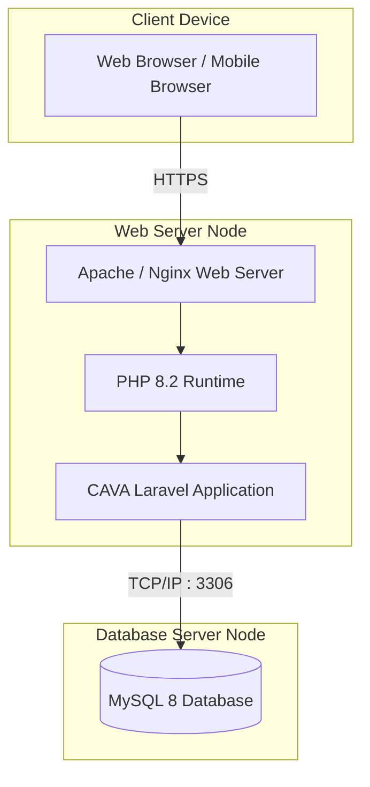

# 03. Deployment Diagram

## Tujuan
Memetakan topologi fisik atau arsitektur eksekusi di lingkungan produksi. Ini menunjukkan *di mana* tepatnya komponen (*artifacts*) di-deploy pada perangkat keras (*nodes*).

## Detail Penjelasan Tiap Node Fisik

### 1. Client Device Node
Merupakan ujung jari pengguna. Bisa berupa Laptop, PC, atau Smartphone.
- **`Web Browser`**: Aplikasi eksekutor (seperti Chrome/Safari). Aplikasi ini merender kode HTML/CSS yang dikirim server dan mengeksekusi JavaScript. Semua pengolahan tampilan grafik berat (seperti merender kalender FullCalendar) terjadi dan memakan RAM di node ini.

### 2. Web Server Node
Mesin (*virtual machine* atau server fisik) yang diletakkan di penyedia layanan awan (*Cloud*).
- **`Apache / Nginx Web Server`**: *Daemon/Service* yang bertugas sebagai satpam pintu masuk. Ia menangkap request masuk dari Client Device dan mengarahkannya ke eksekutor yang tepat.
- **`PHP 8.2 Runtime`**: Mesin yang menerjemahkan kodingan Laravel dari teks mentah menjadi logika.
- **`CAVA Laravel Application`**: Ini adalah *Artifact* (hasil karya *software* kita) berupa folder yang diletakkan di dalam Web Server.

### 3. Database Server Node
Mesin yang didedikasikan (bisa mesin yang sama dengan Web Server, atau mesin terpisah/RDS) untuk mengatur penyimpanan persisten.
- **`MySQL 8 Database`**: Mesin sistem manajemen basis data yang berjalan di node ini.

## Detail Jalur Komunikasi (Protokol)
- **Browser ➔ Apache (`HTTPS`)**: Data yang bergerak dari perangkat pengguna (seperti mengisi form password) wajib melintasi internet publik. Oleh karenanya digunakan **HTTPS** untuk mengenkripsi isi form tersebut agar tidak di-sadap.
- **Laravel ➔ MySQL (`TCP/IP : 3306`)**: Laravel berkomunikasi dengan Database melalui port default 3306 menggunakan driver PDO secara internal di dalam jaringan server (*private network*).

---

## Kode Diagram Mermaid

