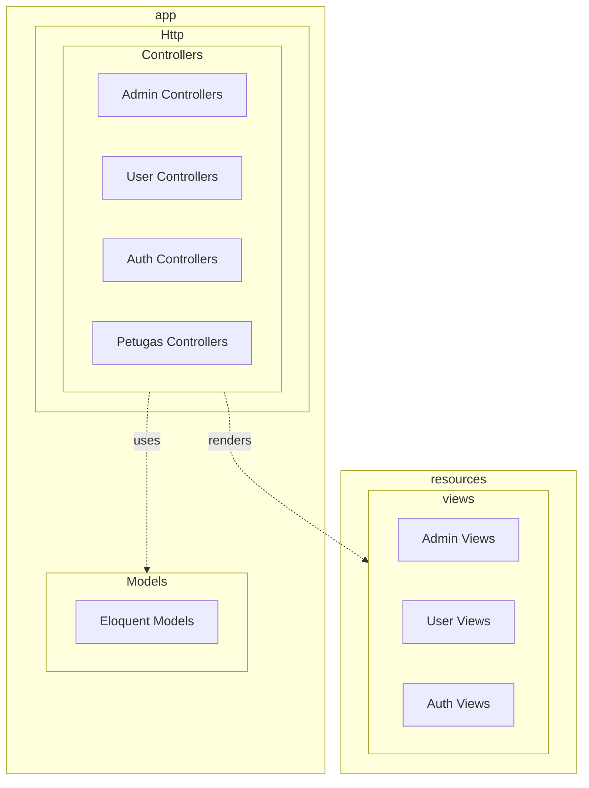

# Package Diagram

## Tujuan
Memberikan ilustrasi kepada *programmer* baru mengenai hierarki sistem map folder, khususnya pada arsitektur MVC (Model-View-Controller) Laravel yang digunakan di CAVA.

## Detail Penjelasan Tiap Paket (*Folder*)

### 1. Paket `Http` (Di dalam `app/`)
Ini adalah paket "pintu masuk logika". Di dalam Laravel, permintaan selalu masuk melalui *Controllers*.
- Karena sistem ini memiliki 4 peran aktor (Pengunjung, Pengguna, Petugas, Admin), maka kontroler dipisahkan ke dalam sub-paket agar kompleksitas kodingan tidak menumpuk dalam satu folder.
- **`AdminC`**: Berisi `AdminDashboardController` dan `FacilityController`.
- **`UserC`**: Berisi `ReservationController` dan `ReportController`.
- **`OfficerC`**: Berisi `ReservationManagementController` khusus untuk logika *approval*.

### 2. Paket `Models` (Di dalam `app/`)
- Paket ini menjadi wadah untuk semua *Eloquent Entities* (seperti `Facility`, `User`, `Reservation`).
- Ini adalah paket terpusat (*centralized package*). Baik `AdminC`, `UserC`, maupun `OfficerC` diizinkan mengambil data dari *Models* yang sama. Inilah wujud sentralisasi *database logic*.

### 3. Paket `views` (Di dalam `resources/`)
Berisi dokumen HTML (Blade). Paket ini sangat struktural.
- Sama seperti *Controllers*, pandangan visual (*views*) dipisahkan mutlak ke dalam sub-folder `AdminV`, `UserV`, dan `AuthV` agar desain dasbor Admin tidak pernah bercampur dengan dasbor Pengguna.

## Jalur Interaksi Antar Paket
- **`Controllers` uses `Models`**: Menandakan bahwa setiap *Controller* akan memanggil *query database* melalui paket *Models*.
- **`Controllers` renders `Views`**: Mengilustrasikan bahwa setelah *Controller* memproses logika, tugas terakhirnya adalah melempar variabel dan memerintahkan sistem untuk menampilkan halaman HTML di paket *Views*.

---

## Kode Diagram Mermaid

