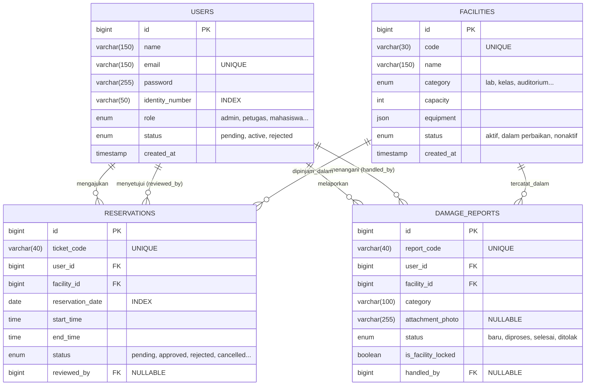

# 05. Entity Relationship Diagram (ERD)

## Tujuan
Memvisualisasikan struktur tabel, kolom, tipe data, dan hubungan (relasi/kardinalitas) antar entitas persisten di dalam basis data MySQL CAVA, sesuai dengan skema migrasi aktual.

## Analisis Tabel & Kolom Utama

### 1. `users` (Tabel Pengguna)
Penyimpan seluruh entitas sivitas akademika.
- **Primary Key:** `id`.
- Atribut penting: `email` (Unik), `identity_number` (NIM/NIP), `role` (enum: admin, petugas, mahasiswa, dll), `status` (pending/active/rejected).

### 2. `facilities` (Tabel Master Fasilitas)
Penyimpan data ruangan atau peralatan.
- **Primary Key:** `id`.
- Atribut penting: `code` (Unik), `category` (enum), `capacity` (int), `equipment` (JSON data pendukung), `status` (aktif/dalam perbaikan/nonaktif).

### 3. `reservations` (Tabel Transaksi Peminjaman)
- **Primary Key:** `id`.
- **Foreign Keys:**
  - `user_id` merujuk ke `users(id)` (Siapa yang meminjam).
  - `facility_id` merujuk ke `facilities(id)` (Ruang apa yang dipinjam).
  - `reviewed_by` merujuk ke `users(id)` (Petugas mana yang me-review).
- Atribut penting: `ticket_code` (Unik), `start_time`, `end_time`, `status`.

### 4. `damage_reports` (Tabel Tiket Kerusakan)
- **Primary Key:** `id`.
- **Foreign Keys:**
  - `user_id` merujuk ke `users(id)`.
  - `facility_id` merujuk ke `facilities(id)`.
  - `handled_by` merujuk ke `users(id)` (Teknisi/Petugas yang menangani).
- Atribut penting: `report_code` (Unik), `attachment_photo`, `status`, `is_facility_locked`.

## Penjelasan Relasi (Kardinalitas)
- Sebuah `User` bisa memiliki `0` hingga banyak (`N`) `Reservation` dan `DamageReport`.
- Sebuah `Facility` bisa terkait dengan `0` hingga banyak (`N`) `Reservation` dan `DamageReport`.
- Hubungan tabel transaksi (`reservations` dan `damage_reports`) terhadap tabel referensi (master) bersifat wajb, karena ada aturan `Cascade On Delete` di tingkat database.

---

## Kode Diagram Mermaid (erDiagram)

